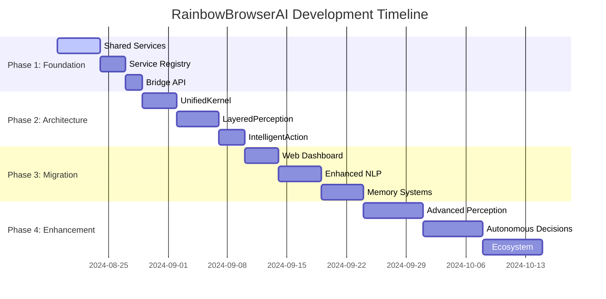

# RainbowBrowserAI: POC-to-Architecture Bridging Plan 🌈

## Executive Summary

**Current State**: We have a **working POC** and a **beautiful architecture** that aren't connected.  
**Goal**: Bridge the gap by systematically migrating POC functionality into the six-organ architecture.  
**Approach**: Modular development with continuous functionality preservation.

---

## Current Status Assessment

### ✅ What We Have
| Component | POC Status | Architecture Status | Integration |
|-----------|------------|-------------------|-------------|
| Browser Control | ✅ Working | 🏗️ Stubs | ❌ Disconnected |
| LLM Integration | ✅ Working | 🏗️ Stubs | ❌ Disconnected |
| Web Dashboard | ✅ Working | ❌ Missing | ❌ Disconnected |
| REST API | ✅ Working | ❌ Missing | ❌ Disconnected |
| Cost Tracking | ✅ Working | ❌ Missing | ❌ Disconnected |
| Workflow Engine | ✅ Working | 🏗️ Partial | ❌ Disconnected |
| Architecture Patterns | ❌ Missing | ✅ Complete | ❌ Disconnected |

### 🎯 The Bridge Challenge
```
POC (Working)          Architecture (Beautiful)
     ↓                        ↑
     🌉 BRIDGE NEEDED 🌉
     ↑                        ↓
   Real Users  ←→  AI Life Form Vision
```

---

## Development Strategy: "Evolution Bridge"

### Core Principle
**Preserve POC functionality while incrementally introducing architecture patterns**

### Phases
1. **Phase 1**: Extract POC functionality into shared libraries
2. **Phase 2**: Implement architecture patterns with POC backends
3. **Phase 3**: Migrate POC features to new architecture
4. **Phase 4**: Enhance with full AI life form capabilities

---

## Phase 1: Foundation Bridge (Week 1-2)

### 1.1 Create Shared Service Layer
**Goal**: Extract working POC functionality into reusable services

```
poc/src/
├── browser.rs           → shared/services/browser_service.rs
├── llm_service.rs       → shared/services/llm_service.rs  
├── cost_tracker.rs      → shared/services/cost_service.rs
├── workflow.rs          → shared/services/workflow_service.rs
└── api.rs              → shared/services/api_service.rs
```

**Tasks**:
- [ ] Create `shared/` directory structure
- [ ] Extract browser automation logic
- [ ] Extract LLM integration logic
- [ ] Extract cost tracking system
- [ ] Extract workflow engine
- [ ] Create service trait interfaces

### 1.2 Implement Service Registry Pattern
**Goal**: Central service discovery and dependency injection

```rust
// shared/services/registry.rs
pub struct ServiceRegistry {
    browser: Arc<dyn BrowserService>,
    llm: Arc<dyn LLMService>,
    cost: Arc<dyn CostService>,
    workflow: Arc<dyn WorkflowService>,
}
```

**Tasks**:
- [ ] Create service registry
- [ ] Define service traits
- [ ] Implement dependency injection
- [ ] Add service lifecycle management

### 1.3 Bridge API Layer
**Goal**: Make POC API work with new service layer

```
poc/src/api.rs → shared/api/
├── handlers/          # POC API handlers
├── middleware/        # Security, metrics, etc.
└── routes.rs         # Route definitions
```

**Tasks**:
- [ ] Extract API handlers
- [ ] Create middleware abstraction
- [ ] Implement route registration
- [ ] Add API versioning support

---

## Phase 2: Architecture Integration (Week 2-3)

### 2.1 Implement UnifiedKernel Pattern
**Goal**: Central orchestration using POC services

```rust
// src/unified_kernel/kernel.rs
pub struct UnifiedKernel {
    services: ServiceRegistry,
    session_manager: SessionManager,
    resource_manager: ResourceManager,
    health_guardian: HealthGuardian,
}
```

**Tasks**:
- [ ] Create kernel with service registry
- [ ] Implement session management
- [ ] Add resource monitoring
- [ ] Create health check system

### 2.2 Implement LayeredPerception
**Goal**: Multi-speed analysis using POC browser service

```rust
// src/layered_perception/perception_engine.rs
pub struct PerceptionEngine {
    browser_service: Arc<dyn BrowserService>,
    lightning_analyzer: LightningAnalyzer,    // <100ms
    quick_analyzer: QuickAnalyzer,            // <500ms  
    standard_analyzer: StandardAnalyzer,      // <2s
    deep_analyzer: DeepAnalyzer,              // <10s
}
```

**Tasks**:
- [ ] Implement lightning perception (DOM snapshot)
- [ ] Implement quick perception (basic analysis)
- [ ] Implement standard perception (content extraction)
- [ ] Implement deep perception (semantic analysis)
- [ ] Create adaptive routing logic

### 2.3 Implement IntelligentAction
**Goal**: Command execution using POC workflow service

```rust
// src/intelligent_action/action_engine.rs
pub struct ActionEngine {
    workflow_service: Arc<dyn WorkflowService>,
    browser_service: Arc<dyn BrowserService>,
    llm_service: Arc<dyn LLMService>,
}
```

**Tasks**:
- [ ] Create action command patterns
- [ ] Implement action validation
- [ ] Add action execution engine
- [ ] Create action result tracking

---

## Phase 3: Feature Migration (Week 3-4)

### 3.1 Migrate Web Dashboard
**Goal**: Connect POC dashboard to new architecture

```
poc/static/ → src/web_interface/
├── dashboard/         # Main dashboard
├── components/        # Reusable UI components
├── api/              # Frontend API client
└── themes/           # UI themes
```

**Tasks**:
- [ ] Create web interface module
- [ ] Migrate dashboard components
- [ ] Connect to UnifiedKernel API
- [ ] Add real-time updates via SSE

### 3.2 Enhanced Natural Language Processing
**Goal**: Improve POC LLM integration with architecture patterns

```rust
// src/natural_language/nlp_engine.rs
pub struct NLPEngine {
    llm_service: Arc<dyn LLMService>,
    intent_parser: IntentParser,
    context_manager: ContextManager,
    response_generator: ResponseGenerator,
}
```

**Tasks**:
- [ ] Create intent classification
- [ ] Implement context management
- [ ] Add conversation memory
- [ ] Create response templates

### 3.3 Implement OptimizedPersistence
**Goal**: Add memory systems to POC functionality

```rust
// src/optimized_persistence/memory_engine.rs
pub struct MemoryEngine {
    vector_store: VectorMemory,     // Embeddings
    graph_store: GraphMemory,       // Relationships
    time_store: TimeMemory,         // Temporal data
    semantic_store: SemanticMemory, // Concepts
}
```

**Tasks**:
- [ ] Implement vector memory (embeddings)
- [ ] Implement graph memory (page relationships)
- [ ] Implement temporal memory (session history)
- [ ] Implement semantic memory (learned concepts)

---

## Phase 4: AI Life Form Enhancement (Week 4-6)

### 4.1 Advanced Perception Capabilities
**Goal**: Add AI sensing beyond basic browser automation

**Tasks**:
- [ ] Visual perception (image analysis)
- [ ] Semantic understanding (content meaning)
- [ ] Pattern recognition (user behavior)
- [ ] Predictive analysis (intent prediction)

### 4.2 Autonomous Decision Making
**Goal**: Enable independent action based on learned patterns

**Tasks**:
- [ ] Decision tree learning
- [ ] Goal-oriented planning
- [ ] Risk assessment
- [ ] Adaptive behavior modification

### 4.3 Ecosystem Integration
**Goal**: Plugin and extension capabilities

**Tasks**:
- [ ] Plugin architecture
- [ ] Extension marketplace
- [ ] Third-party integrations
- [ ] API ecosystem

---

## Implementation Timeline



---

## Development Modules

### Module 1: Browser Service Bridge
**Priority**: Critical  
**Dependencies**: None  
**Timeline**: 3 days

```rust
// shared/services/browser_service.rs
pub trait BrowserService: Send + Sync {
    async fn navigate(&self, url: &str) -> Result<()>;
    async fn screenshot(&self, options: ScreenshotOptions) -> Result<Vec<u8>>;
    async fn extract_content(&self) -> Result<PageContent>;
    async fn interact_element(&self, selector: &str, action: ElementAction) -> Result<()>;
}
```

### Module 2: LLM Service Bridge  
**Priority**: Critical  
**Dependencies**: None  
**Timeline**: 3 days

```rust
// shared/services/llm_service.rs
pub trait LLMService: Send + Sync {
    async fn parse_command(&self, input: &str) -> Result<ParsedCommand>;
    async fn generate_response(&self, context: &Context) -> Result<String>;
    async fn analyze_content(&self, content: &str) -> Result<Analysis>;
}
```

### Module 3: Unified Kernel
**Priority**: High  
**Dependencies**: Module 1, 2  
**Timeline**: 4 days

```rust
// src/unified_kernel/mod.rs
pub struct UnifiedKernel {
    // Core AI brain functionality
}
```

### Module 4: Layered Perception
**Priority**: High  
**Dependencies**: Module 3  
**Timeline**: 5 days

```rust
// src/layered_perception/mod.rs
pub struct PerceptionEngine {
    // Multi-speed sensing capabilities
}
```

### Module 5: Intelligent Action
**Priority**: High  
**Dependencies**: Module 3, 4  
**Timeline**: 4 days

```rust
// src/intelligent_action/mod.rs
pub struct ActionEngine {
    // Smart execution system
}
```

---

## Success Metrics

### Technical Metrics
- [ ] **Functionality Preservation**: 100% POC features working in new architecture
- [ ] **Performance**: No regression in response times
- [ ] **Architecture Compliance**: All modules follow SOLID principles
- [ ] **Test Coverage**: >80% for new modules

### User Experience Metrics
- [ ] **Zero Downtime**: Users can continue using system during migration
- [ ] **Feature Parity**: All POC features available in new system
- [ ] **Enhanced Capabilities**: New AI features demonstrate improvement

### AI Life Form Metrics
- [ ] **Autonomous Behavior**: System can make independent decisions
- [ ] **Learning Capability**: System improves over time
- [ ] **Natural Interaction**: Users feel they're talking to an intelligent entity

---

## Risk Mitigation

### High-Risk Areas
1. **Data Loss**: POC functionality breaking during migration
   - **Mitigation**: Maintain POC in parallel until full migration
2. **Performance Degradation**: New architecture adding overhead
   - **Mitigation**: Continuous performance monitoring and optimization
3. **Feature Gaps**: Missing functionality in new architecture
   - **Mitigation**: Feature-by-feature migration with validation

### Contingency Plans
- **Rollback Strategy**: Ability to revert to POC at any time
- **Parallel Development**: Run both systems until confidence is high
- **Gradual Migration**: Feature flags to control architecture adoption

---

## Next Steps

### Immediate Actions (Next 48 Hours)
1. [ ] Create `shared/` directory structure
2. [ ] Extract browser service from POC
3. [ ] Create service trait definitions
4. [ ] Set up development environment for bridging

### This Week
1. [ ] Complete Module 1: Browser Service Bridge
2. [ ] Complete Module 2: LLM Service Bridge
3. [ ] Begin Module 3: Unified Kernel
4. [ ] Clean up unnecessary documentation files

### Next Week
1. [ ] Complete unified kernel implementation
2. [ ] Begin layered perception implementation
3. [ ] Start intelligent action development
4. [ ] Create integration tests

---

*Last Updated: 2024-08-18*  
*Next Review: After Module 1 completion*