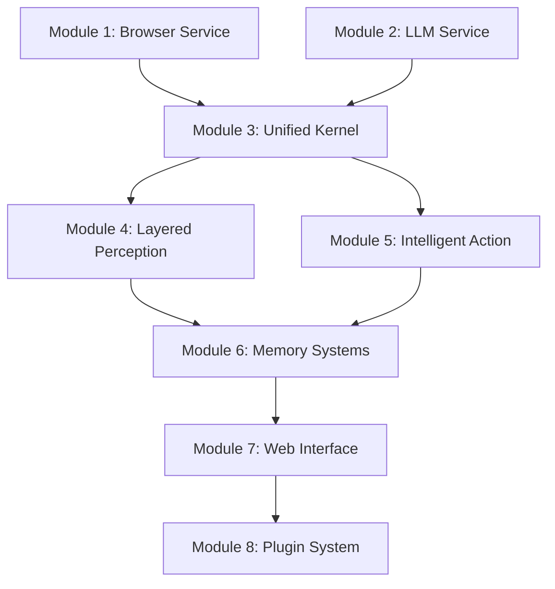

# Modular Development Roadmap 🗺️

## Overview
This roadmap defines the modular approach to bridging POC functionality with the six-organ architecture, ensuring continuous delivery and minimal disruption.

---

## Module Development Strategy

### Core Principles
1. **Functional Continuity**: POC keeps working throughout development
2. **Incremental Integration**: One module at a time
3. **Test-Driven Development**: Each module has comprehensive tests
4. **Independent Deployment**: Modules can be developed in parallel
5. **Backward Compatibility**: New modules support existing APIs

---

## Module Dependency Graph



---

## Module Specifications

### Module 1: Browser Service Bridge 🌐
**File**: `shared/services/browser_service.rs`  
**Priority**: Critical  
**Timeline**: 3 days  
**Team Size**: 1 developer

#### Responsibilities
- Extract browser automation from POC
- Create unified browser interface
- Implement WebDriver abstraction
- Add browser pool management

#### Interface Definition
```rust
#[async_trait]
pub trait BrowserService: Send + Sync {
    async fn create_session(&self) -> Result<SessionId>;
    async fn navigate(&self, session: &SessionId, url: &str) -> Result<NavigationResult>;
    async fn screenshot(&self, session: &SessionId, options: ScreenshotOptions) -> Result<Vec<u8>>;
    async fn extract_content(&self, session: &SessionId) -> Result<PageContent>;
    async fn interact(&self, session: &SessionId, action: InteractionAction) -> Result<()>;
    async fn close_session(&self, session: &SessionId) -> Result<()>;
}
```

#### Implementation Tasks
- [ ] Define browser service trait
- [ ] Extract thirtyfour logic from POC
- [ ] Implement Chrome WebDriver support
- [ ] Add Firefox WebDriver support
- [ ] Create browser pool manager
- [ ] Add session lifecycle management
- [ ] Implement error recovery
- [ ] Add performance monitoring
- [ ] Write comprehensive tests
- [ ] Create usage documentation

#### Success Criteria
- POC browser functionality preserved
- New interface supports multiple browsers
- Pool management reduces resource usage
- Error recovery improves reliability
- 95%+ test coverage

---

### Module 2: LLM Service Bridge 🧠
**File**: `shared/services/llm_service.rs`  
**Priority**: Critical  
**Timeline**: 3 days  
**Team Size**: 1 developer

#### Responsibilities
- Extract LLM integration from POC
- Create provider-agnostic interface
- Implement cost tracking
- Add response validation

#### Interface Definition
```rust
#[async_trait]
pub trait LLMService: Send + Sync {
    async fn parse_command(&self, input: &str, context: &Context) -> Result<ParsedCommand>;
    async fn generate_response(&self, prompt: &str, options: GenerationOptions) -> Result<LLMResponse>;
    async fn analyze_content(&self, content: &str, analysis_type: AnalysisType) -> Result<Analysis>;
    async fn estimate_cost(&self, operation: &LLMOperation) -> Result<f64>;
    async fn get_usage_stats(&self) -> Result<UsageStats>;
}
```

#### Implementation Tasks
- [ ] Define LLM service trait
- [ ] Extract OpenAI logic from POC
- [ ] Add Claude API support
- [ ] Implement local LLM support (Ollama)
- [ ] Create provider factory pattern
- [ ] Add cost tracking and budgets
- [ ] Implement response validation
- [ ] Add rate limiting
- [ ] Create fallback mechanisms
- [ ] Write comprehensive tests

#### Success Criteria
- POC LLM functionality preserved
- Multiple LLM providers supported
- Cost tracking accurate to 99%
- Rate limiting prevents API abuse
- 90%+ test coverage

---

### Module 3: Unified Kernel 🧠⚡
**File**: `src/unified_kernel/mod.rs`  
**Priority**: High  
**Timeline**: 4 days  
**Team Size**: 2 developers

#### Responsibilities
- Central orchestration system
- Service registry and dependency injection
- Session management
- Resource monitoring
- Health monitoring

#### Architecture
```rust
pub struct UnifiedKernel {
    services: ServiceRegistry,
    sessions: SessionManager,
    resources: ResourceManager,
    health: HealthGuardian,
    metrics: MetricsCollector,
}

pub struct ServiceRegistry {
    browser: Arc<dyn BrowserService>,
    llm: Arc<dyn LLMService>,
    storage: Arc<dyn StorageService>,
    workflow: Arc<dyn WorkflowService>,
}
```

#### Implementation Tasks
- [ ] Create kernel architecture
- [ ] Implement service registry
- [ ] Add dependency injection
- [ ] Create session management
- [ ] Implement resource monitoring
- [ ] Add health check system
- [ ] Create metrics collection
- [ ] Add configuration management
- [ ] Implement graceful shutdown
- [ ] Write integration tests

#### Success Criteria
- All services properly registered
- Session management handles concurrency
- Resource usage monitored and limited
- Health checks detect failures
- Metrics provide operational insight

---

### Module 4: Layered Perception 👁️
**File**: `src/layered_perception/mod.rs`  
**Priority**: High  
**Timeline**: 5 days  
**Team Size**: 2 developers

#### Responsibilities
- Multi-speed content analysis
- Adaptive perception routing
- Content understanding
- Pattern recognition

#### Architecture
```rust
pub struct PerceptionEngine {
    lightning: LightningPerception,    // <100ms - Basic DOM
    quick: QuickPerception,            // <500ms - Content structure
    standard: StandardPerception,      // <2s - Semantic analysis
    deep: DeepPerception,              // <10s - Complex understanding
    adaptive: AdaptiveRouter,          // Routes to appropriate level
}
```

#### Implementation Tasks
- [ ] Create perception trait hierarchy
- [ ] Implement lightning perception (DOM snapshot)
- [ ] Implement quick perception (content extraction)
- [ ] Implement standard perception (semantic analysis)
- [ ] Implement deep perception (AI analysis)
- [ ] Create adaptive routing logic
- [ ] Add caching for perception results
- [ ] Implement perception pipeline
- [ ] Add performance monitoring
- [ ] Write perception tests

#### Success Criteria
- Lightning perception <100ms consistently
- Adaptive routing chooses optimal level
- Perception quality improves with time
- Cache hit rate >80%
- Comprehensive test coverage

---

### Module 5: Intelligent Action 🎯
**File**: `src/intelligent_action/mod.rs`  
**Priority**: High  
**Timeline**: 4 days  
**Team Size**: 2 developers

#### Responsibilities
- Command execution engine
- Action planning and validation
- Tool integration
- Result tracking

#### Architecture
```rust
pub struct ActionEngine {
    planner: ActionPlanner,
    executor: ActionExecutor,
    validator: ActionValidator,
    tracker: ResultTracker,
    tools: ToolRegistry,
}
```

#### Implementation Tasks
- [ ] Create action command patterns
- [ ] Implement action planning
- [ ] Add action validation
- [ ] Create execution engine
- [ ] Implement tool registry
- [ ] Add result tracking
- [ ] Create action templates
- [ ] Implement retry logic
- [ ] Add action monitoring
- [ ] Write action tests

#### Success Criteria
- Actions execute reliably
- Planning optimizes action sequences
- Validation prevents harmful actions
- Tool integration seamless
- Result tracking comprehensive

---

### Module 6: Memory Systems 💾
**File**: `src/optimized_persistence/mod.rs`  
**Priority**: Medium  
**Timeline**: 5 days  
**Team Size**: 1 developer

#### Responsibilities
- Vector memory for embeddings
- Graph memory for relationships
- Temporal memory for sequences
- Semantic memory for concepts

#### Architecture
```rust
pub struct MemoryEngine {
    vector: VectorMemory,     // Embeddings and similarity
    graph: GraphMemory,       // Page relationships
    temporal: TemporalMemory, // Time-based sequences
    semantic: SemanticMemory, // Learned concepts
}
```

#### Implementation Tasks
- [ ] Design memory interfaces
- [ ] Implement vector memory
- [ ] Implement graph memory
- [ ] Implement temporal memory
- [ ] Implement semantic memory
- [ ] Create memory indexing
- [ ] Add memory retrieval
- [ ] Implement memory cleanup
- [ ] Add memory analytics
- [ ] Write memory tests

#### Success Criteria
- Memory systems store and retrieve accurately
- Performance scales with data size
- Memory cleanup prevents unbounded growth
- Analytics provide insight into learning
- Test coverage >85%

---

### Module 7: Web Interface 🌐
**File**: `src/web_interface/mod.rs`  
**Priority**: Medium  
**Timeline**: 4 days  
**Team Size**: 1 developer

#### Responsibilities
- Migrate POC dashboard
- Connect to new architecture
- Real-time updates
- Enhanced UI features

#### Implementation Tasks
- [ ] Create web interface module
- [ ] Migrate dashboard components
- [ ] Connect to UnifiedKernel
- [ ] Implement SSE for real-time updates
- [ ] Add enhanced UI features
- [ ] Create responsive design
- [ ] Add accessibility features
- [ ] Implement theming
- [ ] Add user preferences
- [ ] Write UI tests

---

### Module 8: Plugin System 🔌
**File**: `src/plugins/mod.rs`  
**Priority**: Low  
**Timeline**: 6 days  
**Team Size**: 2 developers

#### Responsibilities
- Plugin architecture
- Dynamic loading
- Security sandboxing
- Plugin marketplace

#### Implementation Tasks
- [ ] Design plugin interface
- [ ] Implement plugin loader
- [ ] Create security sandbox
- [ ] Add plugin registry
- [ ] Implement plugin communication
- [ ] Create plugin templates
- [ ] Add plugin marketplace
- [ ] Implement plugin updates
- [ ] Add plugin monitoring
- [ ] Write plugin tests

---

## Development Workflow

### Module Development Process
1. **Design Phase** (Day 1): Architecture design and interface definition
2. **Implementation Phase** (Days 2-N): Core implementation
3. **Testing Phase** (Last day): Comprehensive testing
4. **Integration Phase** (0.5 day): Integration with existing system
5. **Documentation Phase** (0.5 day): Documentation and examples

### Quality Gates
- [ ] **Design Review**: Architecture approved by team
- [ ] **Code Review**: Implementation reviewed by peers
- [ ] **Test Coverage**: Minimum 85% coverage required
- [ ] **Performance Test**: No regression in performance
- [ ] **Integration Test**: Works with existing modules
- [ ] **Documentation**: Complete API docs and examples

### Definition of Done
- [ ] All acceptance criteria met
- [ ] Code reviewed and approved
- [ ] Tests written and passing
- [ ] Documentation complete
- [ ] Performance validated
- [ ] Integrated with main branch

---

## Parallel Development Streams

### Stream 1: Core Services (Week 1)
- **Team A**: Module 1 (Browser Service)
- **Team B**: Module 2 (LLM Service)

### Stream 2: Architecture Integration (Week 2)
- **Team A**: Module 3 (Unified Kernel)
- **Team B**: Module 4 (Layered Perception)

### Stream 3: Feature Enhancement (Week 3)
- **Team A**: Module 5 (Intelligent Action)
- **Team B**: Module 6 (Memory Systems)

### Stream 4: Interface & Extensions (Week 4)
- **Team A**: Module 7 (Web Interface)
- **Team B**: Module 8 (Plugin System)

---

## Risk Management

### Technical Risks
| Risk | Impact | Probability | Mitigation |
|------|--------|-------------|------------|
| POC functionality breaks | High | Medium | Maintain POC in parallel |
| Performance degradation | Medium | High | Continuous performance monitoring |
| Integration failures | Medium | Medium | Comprehensive integration tests |
| Resource constraints | Medium | Low | Resource monitoring and limits |

### Schedule Risks
| Risk | Impact | Probability | Mitigation |
|------|--------|-------------|------------|
| Module dependencies block progress | High | Medium | Parallel development where possible |
| Complex modules take longer | Medium | High | Buffer time in estimates |
| Team member unavailability | Medium | Low | Cross-training and documentation |

---

## Success Metrics

### Technical Metrics
- **Functionality**: 100% POC features preserved
- **Performance**: No regression in response times
- **Quality**: >85% test coverage across all modules
- **Architecture**: All modules follow SOLID principles

### User Experience Metrics
- **Availability**: 99.9% uptime during transition
- **Performance**: <3s response time maintained
- **Features**: All POC features available + new capabilities

### AI Capabilities Metrics
- **Learning**: System demonstrates improved performance over time
- **Autonomy**: System makes appropriate independent decisions
- **Intelligence**: Natural language understanding improves

---

## Next Actions

### Immediate (This Week)
1. [ ] Set up shared services directory structure
2. [ ] Begin Module 1: Browser Service Bridge
3. [ ] Create module development templates
4. [ ] Set up CI/CD for modular development

### Short Term (Next 2 Weeks)
1. [ ] Complete Modules 1-3
2. [ ] Begin Modules 4-5
3. [ ] Set up parallel development environment
4. [ ] Create integration test framework

### Medium Term (Next Month)
1. [ ] Complete all core modules
2. [ ] Begin advanced features
3. [ ] User acceptance testing
4. [ ] Performance optimization

---

*Last Updated: 2024-08-18*  
*Next Review: After Module 1 completion*