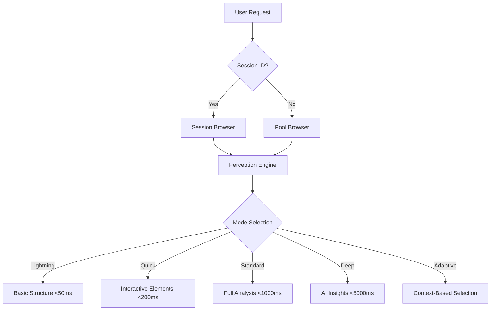

# 🌈 RainbowBrowserAI

**AI-Powered Browser Automation with Session-Aware Layered Perception**

[](#status)
[](#license)
[](#requirements)

## 🚀 Overview

RainbowBrowserAI is an advanced browser automation system that combines AI-powered perception with intelligent session management. It features a layered perception architecture that can analyze web pages at different speeds and depths, making it ideal for both rapid automation and detailed analysis.

### ✨ Key Features

- **🧠 Session-Aware Perception**: Intelligent browser session management with state tracking
- **⚡ Layered Analysis**: Four perception modes (Lightning <50ms, Quick <200ms, Standard <1000ms, Deep <5000ms)
- **🎯 Smart Element Detection**: AI-powered element location and interaction
- **🔧 REST API**: Complete HTTP API for external integration
- **📱 Web Dashboard**: Interactive UI for real-time browser control
- **🤖 Form Automation**: Intelligent form detection and auto-fill capabilities

## 📁 Project Structure

```
RainbowBrowserAI/
├── 🏭 poc-chromiumoxide/     # Main chromiumoxide-based implementation
│   ├── src/
│   │   ├── api/              # REST API endpoints
│   │   ├── browser/          # Browser automation core
│   │   ├── perception/       # Layered perception system
│   │   ├── tools/            # Browser interaction tools
│   │   └── main.rs           # Application entry point
│   ├── static/               # Web dashboard UI
│   └── Cargo.toml
├── 📚 docs/                  # Comprehensive documentation
├── 🧪 poc/                   # Legacy POC (thirtyfour-based)
├── 🔧 examples/              # Usage examples and demos
└── 🧰 scripts/               # Development and deployment scripts
```

## 🎯 Quick Start

### Prerequisites

- **Rust 1.75+**
- **Chrome/Chromium Browser**
- **ChromeDriver** (auto-managed)

### Installation & Run

```bash
# Clone the repository
git clone https://github.com/your-org/RainbowBrowserAI.git
cd RainbowBrowserAI

# Run the chromiumoxide version (recommended)
cd poc-chromiumoxide
cargo run --release -- serve --port 3001

# Open the web dashboard
# Visit: http://localhost:3001
```

### Docker Quick Start

```bash
# Build and run with Docker
docker build -t rainbow-browser-ai .
docker run -p 3001:3001 rainbow-browser-ai
```

## 🔥 Core Capabilities

### 1. **Session-Aware Browser Control**
```bash
# Create a browser session
curl -X POST http://localhost:3001/api/session/create
# {"session_id": "abc-123", "status": "created"}

# Navigate with session tracking
curl -X POST http://localhost:3001/api/navigate \
  -H "Content-Type: application/json" \
  -d '{"url": "https://example.com", "session_id": "abc-123"}'
```

### 2. **Layered Perception System**
```bash
# Lightning-fast analysis (<50ms)
curl -X POST http://localhost:3001/api/perceive-mode \
  -H "Content-Type: application/json" \
  -d '{"mode": "lightning", "session_id": "abc-123"}'

# Deep AI-powered analysis (<5000ms)  
curl -X POST http://localhost:3001/api/perceive-mode \
  -H "Content-Type: application/json" \
  -d '{"mode": "deep", "session_id": "abc-123"}'
```

### 3. **Smart Element Interaction**
```bash
# Intelligent element search
curl -X POST http://localhost:3001/api/smart-element-search \
  -H "Content-Type: application/json" \
  -d '{"query": "submit button", "max_results": 5}'
```

## 📊 Performance Benchmarks

| Perception Mode | Response Time | Use Case |
|-----------------|---------------|----------|
| ⚡ Lightning    | <50ms         | Rapid automation, quick decisions |
| 🚀 Quick       | <200ms        | Interactive exploration |
| 🧠 Standard    | <1000ms       | Detailed analysis with metrics |
| 🔬 Deep        | <5000ms       | AI insights and recommendations |
| ✨ Adaptive    | Auto-select   | Context-aware mode selection |

## 🏗️ Architecture

### Layered Perception System



### Browser Session Management

- **Session Isolation**: Each session maintains independent browser state
- **State Tracking**: URL history, form data, and interaction context
- **Resource Pooling**: Efficient browser instance reuse
- **Auto-Cleanup**: Automatic session expiration and cleanup

## 🧪 API Documentation

### Core Endpoints

| Endpoint | Method | Description |
|----------|--------|-------------|
| `/api/health` | GET | Service health check |
| `/api/session/create` | POST | Create new browser session |
| `/api/navigate` | POST | Navigate to URL |
| `/api/perceive-mode` | POST | Layered perception analysis |
| `/api/click` | POST | Click element |
| `/api/type` | POST | Type text into element |
| `/api/screenshot` | POST | Take page screenshot |

For complete API documentation, see [API Reference](docs/API_REFERENCE.md).

## 🔧 Configuration

### Environment Variables

```bash
# Browser Configuration
RAINBOW_MOCK_MODE=false           # Enable/disable mock mode
CHROMEDRIVER_PORT=9515           # ChromeDriver port
BROWSER_HEADLESS=true            # Headless browser mode

# Server Configuration  
SERVER_PORT=3001                 # API server port
SESSION_TIMEOUT=1800             # Session timeout (seconds)
MAX_SESSIONS=10                  # Maximum concurrent sessions

# Performance Settings
PERCEPTION_CACHE_SIZE=1000       # Perception cache size
BROWSER_POOL_SIZE=5              # Browser pool size
```

## 🧪 Development

### Running Tests

```bash
# Run all tests
cargo test --all-features

# Run specific test suite
cargo test --test perception_tests

# Run with output
cargo test -- --nocapture
```

### Code Quality

```bash
# Format code
cargo fmt

# Run linter
cargo clippy -- -D warnings

# Check compilation
cargo check --all-targets --all-features
```

### Development Server

```bash
# Development mode with hot reload
RUST_LOG=debug cargo run -- serve --port 3001

# Mock mode for testing without browser
RAINBOW_MOCK_MODE=true cargo run -- serve --port 3001
```

## 🚧 Project Status

### ✅ Completed Features

- **Session-aware browser automation** with state management
- **Layered perception system** with 4 analysis modes
- **Complete REST API** with comprehensive endpoints
- **Interactive web dashboard** with real-time controls
- **Smart form handling** with auto-fill capabilities
- **Performance optimizations** and code quality improvements

### 🔄 In Progress

- Enhanced visual perception with computer vision
- Advanced AI-powered element recognition
- Multi-language support for the web interface
- Comprehensive integration tests

### 📋 Roadmap

- [ ] WebSocket support for real-time updates
- [ ] Plugin architecture for custom tools
- [ ] Advanced workflow automation
- [ ] Performance monitoring dashboard
- [ ] Container orchestration support

## 🤝 Contributing

We welcome contributions! Please see our [Contributing Guide](CONTRIBUTING.md) for details.

### Development Setup

1. Fork the repository
2. Create a feature branch: `git checkout -b feature-name`
3. Make your changes and add tests
4. Run the test suite: `cargo test`
5. Submit a pull request

## 📚 Documentation

- [Architecture Guide](docs/ARCHITECTURE.md) - Detailed system architecture
- [API Reference](docs/API_REFERENCE.md) - Complete API documentation
- [Developer Guide](docs/DEVELOPER_GUIDE.md) - Development setup and guidelines
- [Deployment Guide](docs/DEPLOYMENT.md) - Production deployment instructions
- [Perception System](poc-chromiumoxide/PERCEPTION_REFACTOR_SUMMARY.md) - Layered perception details

## ⚖️ License

This project is licensed under the MIT License - see the [LICENSE](LICENSE) file for details.

## 🙏 Acknowledgments

- Built with [chromiumoxide](https://github.com/mattsse/chromiumoxide) for browser automation
- Powered by [Rust](https://www.rust-lang.org/) for performance and safety
- UI framework using modern HTML5/CSS3/JavaScript

---

**Made with 🌈 by the RainbowBrowserAI team**

For questions, issues, or contributions, please visit our [GitHub repository](https://github.com/your-org/RainbowBrowserAI).