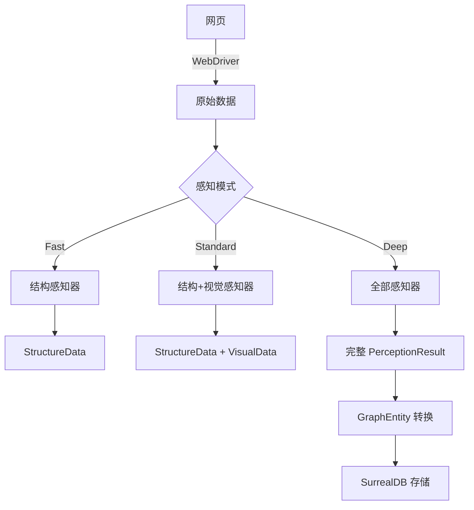

# 彩虹城浏览器 V8.0 数据模型文档

## 📊 概述

彩虹城浏览器 V8.0 的数据模型基于"**图谱化存储思维**"设计，采用 SurrealDB 作为多模型数据库，支持文档、图、时序等多种数据模型。所有数据模型使用 JSON Schema 定义，并提供 TypeScript 类型定义。

### 设计原则

1. **解构归藏，因果成图**：将复杂数据解构为基本实体，按因果关系编织成知识图谱
2. **多层次实体分类**：L0物理层 → L1语义层 → L2认知层 → L3智慧层
3. **类型安全**：所有模型提供严格的类型定义
4. **版本兼容**：向后兼容的 Schema 演进策略

## 🗂️ 核心数据模型

### 1. 感知数据模型

#### PerceptionResult (感知结果)

```typescript
interface PerceptionResult {
  id: string;                      // 唯一标识
  timestamp: string;               // ISO 8601 时间戳
  mode: PerceptionMode;            // Fast | Standard | Deep
  url: string;                     // 页面 URL
  
  structure: StructureData;        // 结构数据
  visual?: VisualData;            // 视觉数据 (Standard/Deep)
  semantic?: SemanticData;        // 语义数据 (Deep)
  
  metadata: {
    duration_ms: number;           // 感知耗时
    version: string;              // 数据模型版本
    perceiver_versions: {
      structural: string;
      visual?: string;
      semantic?: string;
    };
  };
}

// JSON Schema
{
  "$schema": "http://json-schema.org/draft-07/schema#",
  "$id": "https://rainbow-browser.ai/schemas/v8/perception-result.json",
  "type": "object",
  "required": ["id", "timestamp", "mode", "url", "structure", "metadata"],
  "properties": {
    "id": {
      "type": "string",
      "format": "uuid"
    },
    "timestamp": {
      "type": "string",
      "format": "date-time"
    },
    "mode": {
      "type": "string",
      "enum": ["Fast", "Standard", "Deep"]
    },
    "url": {
      "type": "string",
      "format": "uri"
    },
    "structure": {
      "$ref": "#/definitions/StructureData"
    },
    "visual": {
      "$ref": "#/definitions/VisualData"
    },
    "semantic": {
      "$ref": "#/definitions/SemanticData"
    }
  }
}
```

#### StructureData (结构数据)

```typescript
interface StructureData {
  dom_summary: DOMSummary;
  elements: ElementInfo[];
  interactive_elements: InteractiveElement[];
  forms: FormStructure[];
  navigation: NavigationStructure;
  
  statistics: {
    total_elements: number;
    interactive_count: number;
    form_count: number;
    link_count: number;
    image_count: number;
  };
}

interface ElementInfo {
  unique_id: string;              // 系统注入的唯一ID
  tag_name: string;
  text_content: string;
  attributes: Record<string, string>;
  bounding_box: BoundingBox;
  is_visible: boolean;
  is_interactive: boolean;
  xpath: string;
  css_selector: string;
  
  relationships: {
    parent_id?: string;
    children_ids: string[];
    sibling_ids: string[];
  };
}

interface BoundingBox {
  x: number;
  y: number;
  width: number;
  height: number;
}
```

#### VisualData (视觉数据)

```typescript
interface VisualData {
  screenshots: Screenshot[];
  color_scheme: ColorScheme;
  layout_analysis: LayoutAnalysis;
  visual_hierarchy: VisualHierarchy[];
  
  accessibility: {
    contrast_issues: ContrastIssue[];
    missing_alt_texts: string[];    // element IDs
    focus_indicators: boolean;
  };
}

interface Screenshot {
  type: 'full_page' | 'viewport' | 'element';
  format: 'png' | 'jpeg' | 'webp';
  data: string;                    // Base64 编码
  dimensions: {
    width: number;
    height: number;
  };
  quality: number;                 // 0-100
  element_id?: string;             // 元素截图时的元素ID
}

interface ColorScheme {
  primary_colors: string[];        // HEX 颜色
  secondary_colors: string[];
  background_colors: string[];
  text_colors: string[];
  accent_colors: string[];
}
```

#### SemanticData (语义数据)

```typescript
interface SemanticData {
  page_type: PageType;             // 页面类型分类
  main_title: string;
  main_content: string;
  
  entities: SemanticEntity[];      // 识别的实体
  intentions: UserIntention[];     // 用户意图分析
  
  content_structure: {
    headers: HeaderHierarchy[];
    paragraphs: number;
    lists: ListStructure[];
    tables: TableStructure[];
  };
  
  metadata: {
    author?: string;
    publish_date?: string;
    keywords: string[];
    description?: string;
    language: string;
  };
  
  sentiment: {
    overall: 'positive' | 'neutral' | 'negative';
    score: number;                 // -1 to 1
  };
}

interface SemanticEntity {
  id: string;
  type: EntityType;                // Person | Organization | Location | Event | Product
  name: string;
  confidence: number;              // 0-1
  mentions: EntityMention[];
  properties: Record<string, any>;
}

interface UserIntention {
  type: IntentionType;             // Navigate | Search | Purchase | Read | Submit
  confidence: number;
  suggested_actions: SuggestedAction[];
}
```

### 2. 知识图谱模型

#### GraphEntity (图实体)

```typescript
interface GraphEntity {
  id: string;
  type: EntityLevel;               // L0 | L1 | L2 | L3
  category: string;
  created_at: string;
  updated_at: string;
  
  properties: Record<string, any>;
  
  // 多维度关系
  relationships: {
    temporal: TemporalRelation[];
    behavioral: BehavioralRelation[];
    semantic: SemanticRelation[];
    spatial: SpatialRelation[];
    causal: CausalRelation[];
  };
}

enum EntityLevel {
  L0_Physical = "L0",    // URL, DOM, 文件
  L1_Semantic = "L1",    // 概念, 主题, 人物
  L2_Cognitive = "L2",   // 意图, 任务, 目标
  L3_Wisdom = "L3"       // 模式, 洞察, 预测
}
```

#### Relationships (关系模型)

```typescript
// 时间因果关系
interface TemporalRelation {
  type: 'Before' | 'After' | 'During' | 'Triggered';
  target_id: string;
  timestamp: string;
  duration_ms?: number;
}

// 行为因果关系
interface BehavioralRelation {
  type: 'NavigatedTo' | 'ClickedOn' | 'SearchedFor' | 'SubmittedTo';
  target_id: string;
  action_id: string;
  context: Record<string, any>;
}

// 语义关系
interface SemanticRelation {
  type: 'IsA' | 'PartOf' | 'RelatedTo' | 'CausedBy' | 'DependsOn';
  target_id: string;
  strength: number;        // 0-1 关系强度
  evidence: string[];      // 支持此关系的证据
}

// 空间关系
interface SpatialRelation {
  type: 'Contains' | 'NextTo' | 'Above' | 'Below' | 'InsideOf';
  target_id: string;
  position?: Position3D;
}

// 因果关系
interface CausalRelation {
  type: 'Causes' | 'Prevents' | 'Enables' | 'Requires';
  target_id: string;
  probability: number;     // 0-1 因果概率
  conditions: Condition[];
}
```

### 3. 会话状态模型

#### SessionState (会话状态)

```typescript
interface SessionState {
  session_id: string;
  browser_id: string;
  created_at: string;
  last_active: string;
  status: SessionStatus;
  
  pages: PageState[];
  active_page_id?: string;
  
  context: {
    user_agent: string;
    viewport: Viewport;
    locale: string;
    timezone: string;
  };
  
  memory: {
    working_memory: WorkingMemory;
    long_term_memory_refs: string[];  // 引用到长期记忆
  };
  
  metrics: SessionMetrics;
}

interface PageState {
  page_id: string;
  url: string;
  title: string;
  status: PageStatus;
  
  navigation_history: NavigationEntry[];
  perception_history: string[];       // Perception IDs
  action_history: ActionRecord[];
  
  state_snapshots: StateSnapshot[];
}

interface WorkingMemory {
  recent_perceptions: PerceptionSummary[];
  active_intents: UserIntention[];
  context_variables: Record<string, any>;
  attention_focus: AttentionItem[];
}
```

### 4. 行动执行模型

#### ActionRequest (行动请求)

```typescript
interface ActionRequest {
  id: string;
  type: ActionType;
  target: ActionTarget;
  parameters: Record<string, any>;
  
  context: {
    page_id: string;
    perception_id?: string;
    parent_action_id?: string;
  };
  
  constraints: {
    timeout_ms: number;
    retry_count: number;
    wait_conditions: WaitCondition[];
  };
}

interface ActionTarget {
  selector?: string;
  element_id?: string;
  coordinates?: { x: number; y: number };
  url?: string;
}

enum ActionType {
  // 导航类
  NavigateToUrl = "navigate_to_url",
  GoBack = "go_back",
  GoForward = "go_forward",
  Refresh = "refresh",
  
  // 交互类
  Click = "click",
  TypeText = "type_text",
  SelectOption = "select_option",
  ScrollPage = "scroll_page",
  
  // 等待类
  WaitForElement = "wait_for_element",
  WaitForCondition = "wait_for_condition",
  
  // 信息类
  GetElementInfo = "get_element_info",
  TakeScreenshot = "take_screenshot",
  ExtractData = "extract_data"
}
```

#### ActionResult (行动结果)

```typescript
interface ActionResult {
  request_id: string;
  status: 'success' | 'failure' | 'timeout' | 'cancelled';
  
  data?: any;                      // 特定于动作类型的返回数据
  error?: ActionError;
  
  execution: {
    start_time: string;
    end_time: string;
    duration_ms: number;
    retry_count: number;
  };
  
  side_effects: {
    navigation_triggered: boolean;
    dom_changed: boolean;
    new_elements: string[];        // 新出现的元素ID
    removed_elements: string[];    // 消失的元素ID
  };
}

interface ActionError {
  code: ErrorCode;
  message: string;
  details: Record<string, any>;
  recoverable: boolean;
  suggested_actions: SuggestedAction[];
}
```

### 5. 缓存数据模型

#### CacheEntry (缓存条目)

```typescript
interface CacheEntry {
  key: string;
  value: any;
  
  metadata: {
    created_at: string;
    accessed_at: string;
    access_count: number;
    size_bytes: number;
  };
  
  policy: {
    ttl_seconds: number;
    priority: CachePriority;
    eviction_strategy: 'LRU' | 'LFU' | 'FIFO';
  };
  
  tags: string[];                  // 用于批量操作
  dependencies: string[];          // 依赖的其他缓存键
}

enum CachePriority {
  Low = 0,
  Normal = 1,
  High = 2,
  Critical = 3
}
```

### 6. 事件模型

#### SystemEvent (系统事件)

```typescript
interface SystemEvent {
  id: string;
  type: EventType;
  source: EventSource;
  timestamp: string;
  
  payload: Record<string, any>;
  
  context: {
    session_id?: string;
    page_id?: string;
    action_id?: string;
    user_id?: string;
  };
  
  metadata: {
    version: string;
    correlation_id?: string;       // 关联事件追踪
    causation_id?: string;         // 因果链追踪
  };
}

interface EventSource {
  component: string;               // 组件名称
  module: string;                 // 模块名称
  instance_id: string;            // 实例标识
}

enum EventType {
  // 生命周期事件
  SessionCreated = "session.created",
  SessionClosed = "session.closed",
  PageOpened = "page.opened",
  PageClosed = "page.closed",
  
  // 感知事件
  PerceptionStarted = "perception.started",
  PerceptionCompleted = "perception.completed",
  PerceptionFailed = "perception.failed",
  
  // 行动事件
  ActionRequested = "action.requested",
  ActionExecuted = "action.executed",
  ActionFailed = "action.failed",
  
  // 系统事件
  HealthCheckPassed = "health.passed",
  HealthCheckFailed = "health.failed",
  ResourceThresholdExceeded = "resource.threshold_exceeded"
}
```

## 🔄 数据流转示例

### 1. 感知数据流



### 2. 知识图谱构建

```typescript
// 示例：构建页面导航关系图
async function buildNavigationGraph(
  session: SessionState
): Promise<GraphEntity[]> {
  const entities: GraphEntity[] = [];
  
  // 创建 L0 物理实体（页面）
  for (const page of session.pages) {
    const pageEntity: GraphEntity = {
      id: `page:${page.page_id}`,
      type: EntityLevel.L0_Physical,
      category: "WebPage",
      created_at: page.navigation_history[0].timestamp,
      updated_at: page.navigation_history.slice(-1)[0].timestamp,
      properties: {
        url: page.url,
        title: page.title,
        visit_count: page.navigation_history.length
      },
      relationships: {
        temporal: [],
        behavioral: [],
        semantic: [],
        spatial: [],
        causal: []
      }
    };
    
    // 添加时间关系
    if (page.navigation_history.length > 1) {
      pageEntity.relationships.temporal.push({
        type: 'After',
        target_id: `page:${page.navigation_history[0].from_page_id}`,
        timestamp: page.navigation_history[0].timestamp
      });
    }
    
    entities.push(pageEntity);
  }
  
  return entities;
}
```

## 📐 Schema 版本管理

### 版本策略

```typescript
interface SchemaVersion {
  version: string;                 // Semantic Versioning
  released_at: string;
  breaking_changes: boolean;
  migration_script?: string;       // SQL/JavaScript 迁移脚本
  
  changes: {
    added: string[];
    modified: string[];
    deprecated: string[];
    removed: string[];
  };
}

// 当前版本
const CURRENT_SCHEMA_VERSION = "8.0.0";

// 版本兼容性检查
function isCompatible(
  dataVersion: string,
  requiredVersion: string
): boolean {
  const [dataMajor] = dataVersion.split('.');
  const [reqMajor] = requiredVersion.split('.');
  return dataMajor === reqMajor;
}
```

### 迁移示例

```sql
-- V8.0 到 V8.1 迁移脚本
BEGIN TRANSACTION;

-- 添加新字段
UPDATE perception_result 
SET metadata.performance_score = 0.0 
WHERE metadata.performance_score IS NULL;

-- 更新索引
CREATE INDEX idx_performance ON perception_result(metadata.performance_score);

-- 更新版本
UPDATE system_config 
SET schema_version = '8.1.0' 
WHERE key = 'current_schema_version';

COMMIT;
```

## 🔍 查询示例

### SurrealQL 查询

```sql
-- 查找用户最近的导航路径
SELECT 
  id,
  url,
  title,
  ->navigated_to->page AS next_pages,
  <-navigated_from<-page AS prev_pages
FROM page
WHERE 
  session_id = $session_id
  AND created_at > time::now() - 1h
ORDER BY created_at DESC
LIMIT 10;

-- 查找相似的语义实体
SELECT 
  id,
  name,
  type,
  math::similarity::cosine(embedding, $target_embedding) AS similarity
FROM semantic_entity
WHERE 
  type = $entity_type
  AND similarity > 0.8
ORDER BY similarity DESC
LIMIT 20;

-- 分析页面之间的因果关系
SELECT 
  source.url AS from_url,
  target.url AS to_url,
  count() AS transition_count,
  avg(duration_ms) AS avg_duration
FROM behavioral_relation
WHERE 
  type = 'NavigatedTo'
  AND created_at > time::now() - 7d
GROUP BY source.url, target.url
ORDER BY transition_count DESC;
```

## 📊 性能优化建议

1. **索引策略**
   - 为高频查询字段创建索引
   - 使用复合索引优化多条件查询
   - 定期维护索引性能

2. **数据分区**
   - 按时间分区历史数据
   - 按会话分区活跃数据
   - 冷热数据分离存储

3. **缓存策略**
   - L1: 热点实体缓存（<1ms）
   - L2: 查询结果缓存（<10ms）
   - L3: 聚合数据缓存（<50ms）

---

**让数据流动如水，智慧生长如木** 💧🌳