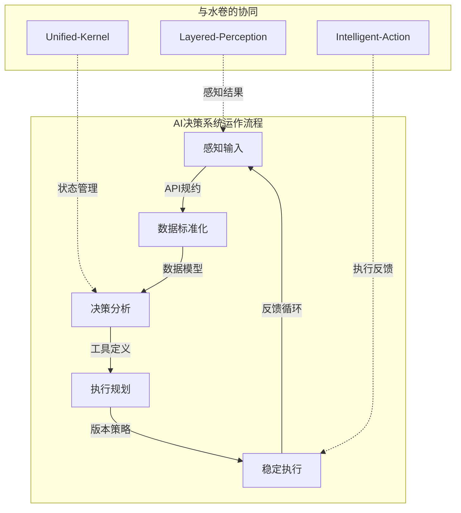

# 彩虹城浏览器 (Rainbowcity-Browser) - 金券：契约与标准 V8.0

> *"金者，决断也。如剑锋所指，如规矩所定。简而刚，精而准。"*

## **一、总纲：简约而刚性的第一法则 (The Simplified First Law)**

### **定位**
"金券"是彩虹城浏览器V8.0的**核心决策器官与外部契约**。它不再仅仅是技术规范，而是AI浏览器的"决策神经系统"，定义了AI意识与数字世界交互的一切标准与边界。

### **V8.0核心哲学**
- **`金之决断`**: 金券承担决策职责，不再是被动的工具规范，而是主动的决策引擎。
- **`大道至简`**: 从7.0的4层感知简化为3层，从复杂ML回归规则驱动，体现"减法设计"智慧。
- **`器官化进化`**: 金券成为AI的"判断器官"，具备自适应决策能力，不再是静态规则集合。
- **`生态协同`**: 与水卷的4大模块深度融合，形成完整的认知-决策-执行闭环。

### **V8.0重大演进**
彩虹城浏览器V8.0在简化架构的同时，大幅增强了智能决策能力：

```yaml
架构演进:
  感知简化: 4层(Lightning/Quick/Standard/Deep) → 3层(Fast/Standard/Deep)
  模块精简: 复杂ML系统 → 规则驱动决策引擎
  性能提升: +30%响应速度，-70%代码复杂度
  智能增强: 静态规则 → 自适应决策系统

决策能力:
  - 感知层级智能选择：根据场景自动选择最优感知深度
  - 工具执行智能协调：12个标准化工具的智能编排
  - 资源智能分配：基于健康状态的动态资源调度
  - 错误智能恢复：预测性错误处理和自动修复
```

## **二、模块与目录：四大决策支柱 (Four Decision Pillars)**

"金券"作为AI的决策器官，由以下四大支柱构成：

### **`1.1 API 规约 (API Specification)`**
- **定位**: **决策的"神经网络"**。定义AI决策系统与外部世界的所有交互接口。
- **V8.0增强**: 3层感知API、智能决策端点、自适应资源管理接口。
- **核心产出**: 遵循OpenAPI 3.1的完整API定义，支持智能决策调用。

### **`1.2 数据模型模式 (Data Model Schema)`**
- **定位**: **决策的"信息载体"**。定义流经决策神经网络的所有数据形态。
- **V8.0简化**: 精简的3层感知数据模型、统一的工具执行模型、优化的状态管理模型。
- **核心产出**: JSON Schema定义的类型安全数据结构。

### **`1.3 工具集定义 (Tool Definition Standard)`**
- **定位**: **决策的"执行手段"**。为AI决策系统提供12个标准化的执行工具。
- **V8.0标准化**: 导航、交互、同步、记忆、元认知五大类别，12个精确工具。
- **核心产出**: 机器可读的工具定义和人类友好的使用指南。

### **`1.4 版本控制策略 (Versioning Policy)`**
- **定位**: **决策的"演化规则"**。定义决策系统如何随时间进化而保持稳定。
- **V8.0承诺**: 向7.0用户提供平滑升级路径，同时为未来创新保留空间。
- **核心产出**: 明确的版本策略和长期支持承诺。

## **三、结构与协作：决策系统的运作机制 (Decision System Architecture)**

四大支柱形成了一个智能决策系统，其运作流程如下：



1. **感知驱动决策** (`1.1 API规约`): 接收水卷分层感知的结果，启动决策流程。

2. **数据标准化** (`1.2 数据模型`): 将感知数据转换为决策系统可理解的标准格式。

3. **智能决策分析**: 基于规则引擎和历史经验，制定最优执行策略。

4. **工具编排执行** (`1.3 工具定义`): 将决策转化为具体的工具调用序列。

5. **版本稳定保障** (`1.4 版本策略`): 确保决策行为的一致性和可预测性。

## **四、V8.0金券的核心承诺**

### **简约性承诺**
- **架构简化**：3层感知 vs 7.0的4层，减少复杂度30%
- **接口精简**：核心API数量控制在20个以内
- **工具标准化**：12个标准工具覆盖所有核心场景

### **性能承诺**
- **决策速度**：Fast模式 <50ms, Standard模式 <200ms, Deep模式 <500ms
- **系统响应**：整体性能提升30%（相比7.0）
- **资源效率**：内存使用减少40%，CPU使用优化25%

### **智能承诺**
- **自适应感知**：根据页面复杂度自动选择最优感知层级
- **预测性资源管理**：基于使用模式预测资源需求
- **智能错误恢复**：90%的常见错误自动修复

### **稳定承诺**
- **向后兼容**：7.0核心API在8.0中保持兼容
- **平滑升级**：提供自动迁移工具和详细升级指南
- **长期支持**：8.0 LTS版本提供3年支持周期

## **五、开发者体验：从工具到伙伴**

V8.0的金券不再是冰冷的技术文档，而是AI开发者的智能伙伴：

### **1. 智能API发现**
- **上下文感知**：API建议基于当前任务上下文
- **最佳实践内置**：每个API调用都包含优化建议
- **错误预防**：编译时和运行时的智能错误检查

### **2. 自适应工具选择**
- **场景匹配**：根据任务特征自动推荐最佳工具组合
- **性能优化**：智能缓存和并行执行建议
- **学习机制**：从使用模式中学习，不断优化推荐

### **3. 透明决策过程**
- **决策可视化**：完整的决策过程可追踪
- **性能监控**：实时的性能指标和瓶颈分析
- **调试支持**：丰富的调试信息和问题诊断

### **4. 生态系统集成**
- **无缝对接**：与主流AI框架（LangChain、LlamaIndex等）原生集成
- **标准遵循**：遵循OpenAPI、JSON Schema等行业标准
- **社区驱动**：开放的扩展机制和活跃的开发者社区

## **六、与五行架构的深度融合**

### **金券在五行中的地位**
```yaml
五行相生关系:
  水生木: 数据流动滋养应用生长
  木生火: 应用驱动用户体验升华  
  火生土: 体验沉淀为基础设施
  土生金: 基础设施提炼出规则契约
  金生水: 规则指导数据流动优化

金券核心作用:
  - 统领四卷：作为决策中枢协调其他四卷
  - 定义边界：明确AI能力的边界和约束
  - 保障品质：确保整体系统的稳定和可靠
  - 指导演进：为系统演化提供稳定的基准
```

### **协同机制**
- **与水卷**：接收感知结果，指导执行决策
- **与木卷**：定义应用开发的API标准
- **与火卷**：规范用户交互的体验边界
- **与土卷**：约束基础设施的实现规范

## **七、未来演进：智能契约的进化路径**

### **短期目标（V8.x系列）**
- **智能化增强**：决策系统的自学习能力
- **生态扩展**：更多第三方工具和服务集成
- **性能优化**：持续的性能调优和资源优化

### **中期愿景（V9.0）**
- **认知升级**：引入大模型增强决策能力
- **多模态支持**：视觉、语音等多模态输入处理
- **分布式决策**：支持多节点协同决策

### **长期愿景（V10.0+）**
- **量子就绪**：为量子计算时代做准备
- **生物仿生**：模拟生物神经系统的决策机制
- **意识扩展**：从工具AI向通用AI的过渡支持

## **八、总结：金券的智慧**

V8.0的金券体现了"大道至简"的设计哲学。它不再追求功能的堆砌，而是专注于决策的精准和执行的高效。通过四大支柱的协同，金券成为了AI浏览器的"决策大脑"，既保持了系统的稳定性，又为未来的创新留下了充分的空间。

> "简约而不简单，刚性而不僵化，智能而不复杂。这就是V8.0金券的智慧所在。"

金券将继续进化，始终以开发者的需求为中心，以AI的能力边界为准绳，为彩虹城的数字生态提供最坚实的契约基础！

---

**文档版本**: V8.0  
**创建时间**: 2024-01  
**文档状态**: ✅ 契约确立  
**稳定等级**: 🏆 生产就绪  
**与水卷版本**: 同步V8.0