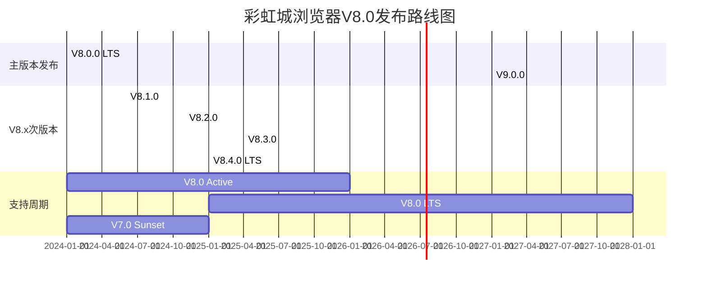
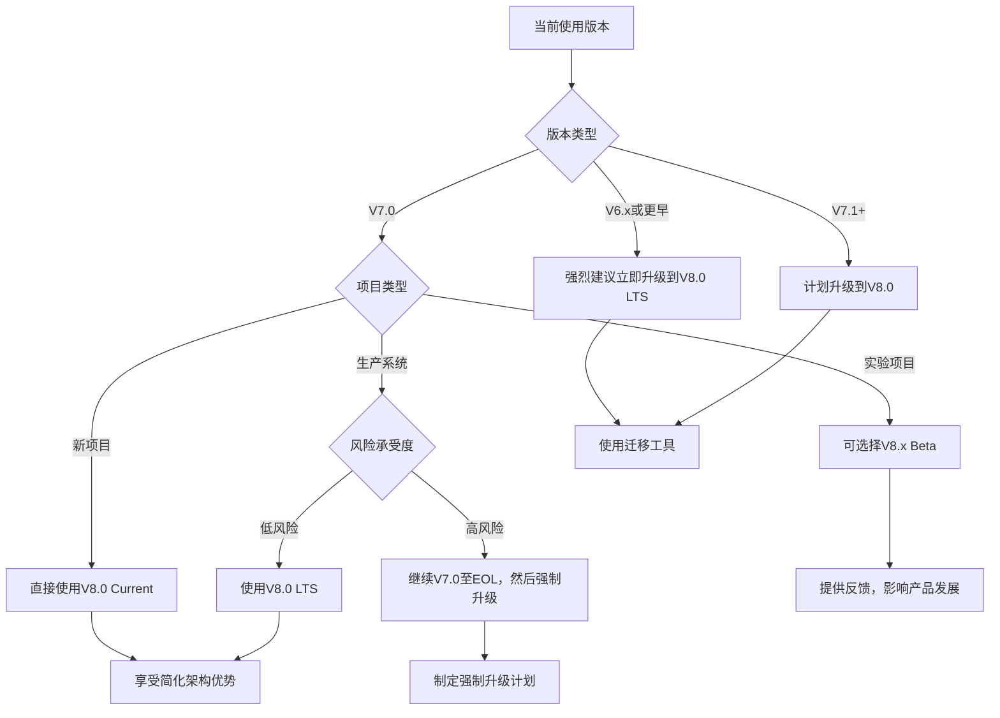

# 彩虹城浏览器 (Rainbowcity-Browser) - 金券：契约与标准 V8.0

## **章节：1.4 版本控制策略 (Versioning Policy)**

## **一、定位与使命 (Positioning & Mission)**

### **1.1 模块定位**
本章节定义彩虹城浏览器V8.0如何在"大道至简"的演进道路上保持稳定。版本控制策略不仅是技术演进的指南，更是我们对开发者社区长期承诺的体现，确保在简化架构的同时维护生态稳定。

### **1.2 核心问题**
本策略旨在解决：如何在V8.0"简约而强大"的设计理念下，既支持7.0用户的平滑升级，又为未来的创新发展预留空间？如何让开发者在享受简化优势的同时，获得长期稳定的支持保障？

### **1.3 应用场景**
- 开发者根据V8.0的简化策略重新评估系统架构，选择最适合的升级路径
- 企业用户基于LTS承诺制定长期技术路线，享受简化架构带来的维护成本降低
- SDK维护者按照V8.0的版本节奏更新，利用标准化工具减少开发复杂度

### **1.4 能力边界**
- **本策略做什么**: 定义V8.0简化架构的版本规则、7.0到8.0的迁移路径、长期支持计划、未来演进方向。
- **本策略不做什么**: 不阻止架构创新，不限制功能演进，不强制使用特定技术栈。

## **二、设计思想与哲学基石 (Design Philosophy & Foundational Principles)**

V8.0版本控制策略体现了"简约稳定"的核心理念：

1. **简化优先 (`大道至简`)**: 通过减少复杂性来提升稳定性，简单的系统更容易维护和升级。

2. **平滑演进 (`承前启后`)**: 尊重7.0用户的投入，提供完整的迁移支持和兼容保障。

3. **长期视角 (`谋定后动`)**: V8.0的简化设计为未来5-10年的发展奠定坚实基础。

4. **透明承诺 (`言出必行`)**: 明确的版本承诺和支持时间，让用户安心规划。

5. **生态友好 (`共生共荣`)**: 版本策略考虑整个AI开发生态的长期健康发展。

## **三、语义化版本规范 (Semantic Versioning)**

### **3.1 V8.0版本号格式**

```
MAJOR.MINOR.PATCH-PRERELEASE+BUILD

V8.0示例：
8.0.0          # LTS基础版本
8.1.0          # 功能增强版本  
8.0.1          # 问题修复版本
8.2.0-beta.1   # 预发布版本
8.0.0+20240131 # 带构建信息
```

### **3.2 版本递增规则（V8.0优化）**

```yaml
MAJOR (主版本号) - 简化架构变更:
  触发条件:
    - 架构简化导致的不兼容变更
    - 核心概念模型的重大调整
    - 移除已弃用功能（充分通知后）
  示例: 7.0.0 → 8.0.0
  频率: 2-3年一次
  特点: V8.0专注"减法设计"，主版本升级更多体现架构简化
  
MINOR (次版本号) - 功能增强:
  触发条件:
    - 新增标准化工具或增强现有工具
    - 新增感知层级或优化现有层级
    - 性能显著提升（20%+）
    - 新增开发者友好特性
  示例: 8.0.0 → 8.1.0
  频率: 4-6个月一次（比7.0放缓，因为架构更稳定）
  特点: 重质量而非数量，每次更新都有实质价值
  
PATCH (修订号) - 质量提升:
  触发条件:
    - 错误修复和稳定性改进
    - 性能优化（<20%提升）
    - 安全补丁
    - 文档更新和示例改进
  示例: 8.0.1 → 8.0.2
  频率: 2-3周一次（根据需要）
  特点: 快速响应，确保系统稳定运行
```

### **3.3 预发布版本策略**

```yaml
V8.0预发布流程:
  Alpha (-alpha.N):
    - 内部测试，架构验证
    - API接口可能调整
    - 性能基准测试
    持续时间: 4-6周
    
  Beta (-beta.N):
    - 公开测试，社区反馈
    - API接口基本稳定
    - 兼容性测试完成
    持续时间: 6-8周
    
  Release Candidate (-rc.N):
    - 发布候选，最终验证
    - 只修复关键问题
    - 生产环境试点
    持续时间: 2-4周
    特点: V8.0的RC阶段更注重简化验证，确保减法设计的正确性
```

## **四、发布周期与支持策略**

### **4.1 V8.0发布时间线**



### **4.2 长期支持版本 (LTS)**

```yaml
V8.0 LTS策略:
  发布周期: 每年1月发布一个LTS版本
  支持期限: 3年完整支持 + 1年安全更新
  版本标识: 8.0.0 LTS, 8.4.0 LTS, 9.0.0 LTS
  
V8.0.0 LTS (已发布):
  发布日期: 2024-01-01
  活跃维护期: 2024-01 → 2025-12 (新功能 + 修复)
  LTS支持期: 2025-01 → 2028-01 (安全修复)
  终止日期: 2028-01-01
  
V8.4.0 LTS (计划):
  发布日期: 2025-01-01  
  活跃维护期: 2025-01 → 2026-12
  LTS支持期: 2026-01 → 2029-01
  
LTS承诺:
  - 3年安全更新保障
  - 关键错误快速修复
  - 向后兼容性严格保持
  - 企业级技术支持可选
  - 迁移指南和工具支持
  
V8.0 LTS特色:
  - 简化架构降低维护成本
  - 标准化工具减少兼容性问题
  - 智能化特性提升系统稳定性
```

### **4.3 版本生命周期管理**

```yaml
版本状态定义:
  Current (当前版本):
    - 最新的稳定版本
    - 获得所有类型更新
    - 新项目推荐使用
    - 完整的技术支持
    
  Active (活跃版本):
    - 前1-2个次版本
    - 接收功能更新和修复
    - 现有项目可继续使用
    - 标准技术支持
    
  LTS (长期支持):
    - 指定的LTS版本
    - 3年支持承诺
    - 仅安全和关键修复
    - 企业生产环境推荐
    
  Maintenance (维护版本):
    - 接近EOL的版本
    - 仅关键安全修复
    - 建议规划升级
    - 有限技术支持
    
  End of Life (停止支持):
    - 完全停止更新
    - 文档保留但不维护
    - 必须升级到支持版本
    - 无技术支持

V8.0版本状态时间线:
  2024年: V8.0 Current, V7.0 Maintenance
  2025年: V8.1 Current, V8.0 LTS, V7.0 EOL
  2026年: V8.2+ Current, V8.0 LTS
  2027年: V8.x Current, V8.0 LTS
  2028年: V9.0 Current, V8.0 EOL
```

## **五、7.0到8.0迁移策略**

### **5.1 兼容性评估**

```yaml
兼容性分析:
  完全兼容:
    - 核心API端点保持不变
    - 基础数据模型结构兼容
    - 主要工具功能向后兼容
    - 认证和安全机制兼容
    
  简化优化:
    - 4层感知简化为3层（快速、标准、深度）
    - 工具集从10+个标准化为12个
    - 错误码体系简化但保持映射
    - 配置选项精简，提供默认值
    
  增强特性:
    - 新增智能决策上下文
    - 增强错误恢复机制
    - 优化性能监控
    - 强化安全特性
    
  弃用功能:
    - 7.0的Lightning层（映射到8.0的Fast层）
    - 复杂的ML配置选项（自动化处理）
    - 部分冗余的配置参数
    - 实验性功能清理
```

### **5.2 自动化迁移工具**

```yaml
迁移工具套件:
  配置迁移工具:
    功能: 自动转换7.0配置到8.0格式
    特点: 
      - 智能映射感知层级
      - 保留关键配置项
      - 生成详细迁移报告
      - 验证转换结果
    
  代码迁移助手:
    功能: 协助代码升级到8.0 API
    特点:
      - 静态代码分析
      - API调用自动替换
      - 不兼容项高亮标注
      - 最佳实践建议
    
  数据迁移器:
    功能: 历史数据格式升级
    特点:
      - 批量数据转换
      - 数据完整性校验
      - 增量迁移支持
      - 回滚机制
    
  兼容性检查器:
    功能: 全面兼容性评估
    特点:
      - 自动依赖分析
      - 风险评估报告
      - 迁移优先级建议
      - 测试用例生成
```

### **5.3 迁移路径指导**

```yaml
渐进式迁移策略:
  阶段1 - 评估准备 (1-2周):
    - 运行兼容性检查器
    - 评估迁移工作量
    - 制定迁移计划
    - 准备测试环境
    
  阶段2 - 并行运行 (2-4周):
    - 部署8.0环境
    - 配置双环境运行
    - 对比测试结果
    - 逐步切换流量
    
  阶段3 - 全面切换 (1-2周):
    - 完全切换到8.0
    - 监控系统稳定性
    - 性能基准对比
    - 问题快速修复
    
  阶段4 - 优化完善 (2-4周):
    - 利用8.0新特性
    - 优化系统配置
    - 清理7.0遗留
    - 团队培训

风险控制:
  - 每个阶段都有回滚方案
  - 关键指标持续监控
  - 专门的迁移支持团队
  - 24/7紧急响应机制
```

## **六、向后兼容性保证**

### **6.1 兼容性承诺矩阵**

```yaml
API兼容性:
  Level 1 - 核心API:
    承诺: 100%向后兼容
    范围: 会话管理、基础感知、核心工具
    保证期: 整个8.x生命周期
    
  Level 2 - 扩展API:
    承诺: 95%向后兼容
    范围: 高级功能、性能监控、调试接口
    保证期: 至少2年
    
  Level 3 - 实验性API:
    承诺: 尽力兼容，提前通知变更
    范围: 新特性、beta功能
    保证期: 6个月通知期

数据兼容性:
  请求格式: 7.0格式在8.0中完全支持
  响应格式: 8.0响应包含7.0所有字段
  错误格式: 错误码映射表确保兼容
  配置格式: 自动转换工具处理

行为兼容性:
  核心行为: 关键功能行为保持一致
  性能行为: 性能只能更好，不会降低
  错误行为: 错误处理行为向后兼容
  扩展行为: 新行为通过选项启用
```

### **6.2 破坏性变更管理**

```yaml
破坏性变更流程:
  1. 影响评估阶段 (变更前6个月):
     - 详细影响分析
     - 用户反馈收集
     - 替代方案设计
     - 成本效益评估
     
  2. 公告通知阶段 (变更前4个月):
     - 多渠道发布公告
     - 技术文档更新
     - 迁移指南发布
     - 社区讨论启动
     
  3. 弃用标记阶段 (变更前2个月):
     - 在7.0中标记弃用
     - 运行时警告输出
     - 使用统计收集
     - 迁移工具发布
     
  4. 迁移支持阶段 (变更后6个月):
     - 专门技术支持
     - 迁移问题快速响应
     - 文档持续完善
     - 工具功能增强
     
  5. 正式移除阶段 (下一个主版本):
     - 功能正式移除
     - 清理遗留代码
     - 文档归档保留
     - 社区通知

V8.0特定承诺:
  - 7.0的Lightning层级在8.0中映射为Fast层
  - 7.0的工具调用格式100%兼容
  - 7.0的错误码在8.0中保持有效
  - 7.0的配置文件可直接升级使用
```

## **七、版本选择指南**

### **7.1 场景化版本选择**

```yaml
新项目选择:
  推荐: V8.0 Current
  理由: 享受简化架构带来的开发效率提升
  收益: 更少的配置，更智能的默认值，更好的性能
  
生产环境:
  推荐: V8.0 LTS  
  理由: 长期稳定支持，架构简化降低维护成本
  收益: 3年支持保障，简化运维，降低总体拥有成本
  
实验项目:
  推荐: V8.x Beta
  理由: 体验最新特性，提供反馈
  收益: 影响产品方向，获得早期技术优势
  
企业应用:
  推荐: V8.0 LTS + 企业支持
  理由: 最大化稳定性，专业支持保障
  收益: SLA保证，定制化支持，优先问题解决
  
遗留系统:
  推荐: 渐进式升级到V8.0
  理由: 利用兼容性保证平滑升级
  收益: 享受简化优势，降低维护复杂度
```

### **7.2 升级决策树**



## **八、版本信息获取与监控**

### **8.1 版本信息API**

```yaml
GET /version
Response:
{
  "version": "8.0.1",
  "major": 8,
  "minor": 0,
  "patch": 1,
  "prerelease": null,
  "build_info": {
    "build_date": "2024-01-31",
    "build_hash": "a1b2c3d4",
    "build_environment": "production"
  },
  "release_info": {
    "release_date": "2024-01-15",
    "is_lts": true,
    "lts_until": "2028-01-01",
    "support_level": "full"
  },
  "compatibility_info": {
    "supports_v7_api": true,
    "migration_tools_available": true,
    "deprecated_features": []
  },
  "ecosystem_info": {
    "latest_stable": "8.0.1",
    "latest_lts": "8.0.1", 
    "next_planned": "8.1.0",
    "next_planned_date": "2024-06-01"
  }
}
```

### **8.2 版本监控与通知**

```yaml
监控机制:
  版本检查API:
    - 实时版本状态查询
    - 升级建议获取
    - 兼容性检查
    - 安全公告获取
    
  自动通知服务:
    - 新版本发布通知
    - 安全更新提醒
    - EOL预警通知
    - 迁移截止日期提醒
    
  监控仪表板:
    - 版本使用分布统计
    - 升级进度跟踪
    - 兼容性问题统计
    - 社区反馈聚合

通知渠道:
  - 官方网站公告
  - 邮件订阅列表
  - RSS/Atom feeds
  - Webhook回调
  - 社区论坛
  - 开发者社交媒体
```

## **九、V8.0版本策略的独特价值**

### **9.1 简化带来的价值**

```yaml
架构简化价值:
  开发效率提升:
    - 配置项减少60%，上手更快
    - API数量精简，学习曲线平缓
    - 标准化工具，开发更规范
    
  运维成本降低:
    - 系统复杂度降低，故障点减少
    - 监控指标简化，运维更轻松
    - 资源消耗优化，硬件成本下降
    
  升级维护简化:
    - 向后兼容性更好维护
    - 测试覆盖更全面
    - 问题定位更快速
```

### **9.2 长期生态价值**

```yaml
生态系统优势:
  开发者生态:
    - 降低入门门槛，扩大用户群体
    - 提升开发体验，增强用户粘性
    - 标准化接口，促进生态繁荣
    
  企业价值:
    - 降低总体拥有成本
    - 提升系统可靠性
    - 简化团队培训
    
  技术演进:
    - 为AI原生架构奠定基础
    - 为云原生部署优化
    - 为未来创新预留空间
```

## **十、总结：版本控制的智慧**

V8.0的版本控制策略体现了"减法设计"的智慧。通过简化架构，我们不仅降低了系统复杂度，也让版本管理变得更加清晰可控。

### **核心承诺**
- **稳定性承诺**：3年LTS支持，让用户安心投入
- **简化承诺**：持续简化，不会回到复杂状态
- **兼容性承诺**：平滑升级，保护用户投资
- **创新承诺**：在简化基础上持续创新

### **长远愿景**
V8.0不仅是一个版本，更是彩虹城浏览器面向未来的战略转型。通过"减法设计"，我们为下一个10年的发展奠定了坚实基础。

---

> *"版本如流水，承诺如磐石。简化而不简陋，稳定而不保守。这就是V8.0版本控制的智慧所在。"*

**文档版本**: V8.0  
**创建时间**: 2024-01  
**文档状态**: ✅ 策略确立  
**稳定等级**: 🏆 长期有效