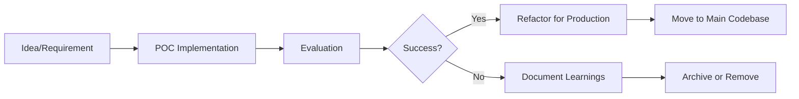

# RainbowBrowserAI POC Module Documentation

## POC (Proof of Concept) Module Overview

The `poc/` directory contains experimental features, prototypes, and proof-of-concept implementations for the RainbowBrowserAI project. This module serves as a testing ground for new ideas before they are integrated into the main codebase.

## POC Module Structure

```
poc/
├── Cargo.toml              # POC-specific dependencies and configuration
├── README.md               # POC module overview and experiment index
├── src/
│   ├── main.rs            # POC runner/orchestrator
│   ├── lib.rs             # Shared POC utilities
│   ├── api.rs             # API experiments
│   ├── workflow.rs        # Workflow automation experiments
│   └── plugins/           # Plugin system experiments
│       ├── mod.rs
│       └── manager.rs
├── static/                 # Frontend assets for POC demos
│   ├── index.html         # POC web interface
│   ├── app.js             # JavaScript for POC demos
│   └── styles.css         # Styling for POC interface
├── examples/               # Runnable POC examples
│   ├── basic_browser_control.rs
│   ├── ai_integration_demo.rs
│   └── workflow_automation.rs
├── tests/                  # POC-specific tests
│   ├── integration_tests.rs
│   └── performance_benchmarks.rs
├── docs/                   # POC documentation
│   ├── API_DOCUMENTATION.md
│   ├── PLUGIN_ARCHITECTURE.md
│   └── EXPERIMENT_LOG.md
└── scripts/                # Helper scripts for POC
    ├── setup.sh
    └── run_experiments.sh
```

## POC Development Guidelines

### 1. Purpose and Scope

**What belongs in POC:**

- Experimental features not ready for production
- New architecture patterns being evaluated
- Performance optimization experiments
- Integration tests with external services
- UI/UX prototypes
- Algorithm experiments

**What doesn't belong in POC:**

- Production-ready code (move to main src/)
- Stable APIs
- Customer-facing features
- Security-critical components

### 2. POC Lifecycle



### 3. POC-Specific Configuration

```toml
# poc/Cargo.toml
[package]
name = "rainbow-browser-poc"
version = "0.0.1"
edition = "2021"
publish = false  # Never publish POC

[dependencies]
# Include main project as dependency
rainbow-browser-ai = { path = ".." }

# POC-specific experimental dependencies
experimental-crate = "0.1"
unstable-feature = { version = "0.1", features = ["experimental"] }

[features]
default = []
experimental = []  # Enable all experimental features
unsafe-experiments = []  # For performance experiments

[[bin]]
name = "poc-runner"
path = "src/main.rs"

[[example]]
name = "demo"
path = "examples/basic_demo.rs"
```

### 4. Coding Standards for POC

#### Experimental Code Markers

```rust
// Mark experimental code clearly
#[cfg(feature = "experimental")]
mod experimental_feature {
    //! WARNING: This module is experimental and may change or be removed
    
    /// EXPERIMENTAL: This API is not stable
    pub fn experimental_function() {
        todo!("Implement experimental feature")
    }
}

// Use TODO and FIXME liberally
// TODO(username): Evaluate performance impact
// FIXME: This is a temporary workaround for POC
```

#### Documentation Requirements

```rust
//! # Experiment: New Browser Control API
//! 
//! **Status**: In Progress
//! **Author**: @username
//! **Date**: 2024-01-15
//! **Tracking Issue**: #123
//! 
//! ## Purpose
//! Testing a new approach to browser control that...
//! 
//! ## Results
//! - Performance: 20% faster than current implementation
//! - Memory usage: Similar to current
//! - Code complexity: Slightly higher
//! 
//! ## Decision
//! Pending review by team
```

### 5. POC Testing Strategy

#### Quick Validation Tests

```rust
#[cfg(test)]
mod poc_tests {
    use super::*;
    
    #[test]
    #[ignore] // Ignore in normal test runs
    fn poc_expensive_test() {
        // Test that takes too long for CI
    }
    
    #[test]
    fn poc_smoke_test() {
        // Quick validation that POC compiles and runs
    }
}
```

#### Performance Benchmarks

```rust
#[cfg(all(test, not(debug_assertions)))]
mod benchmarks {
    use criterion::{black_box, criterion_group, criterion_main, Criterion};
    
    fn benchmark_new_approach(c: &mut Criterion) {
        c.bench_function("new_algorithm", |b| {
            b.iter(|| {
                // Benchmark code
            });
        });
    }
    
    criterion_group!(benches, benchmark_new_approach);
    criterion_main!(benches);
}
```

### 6. Running POC Experiments

```bash
# Run all POC experiments
cd poc
cargo run --bin poc-runner

# Run specific experiment
cargo run --example workflow_automation

# Run with experimental features
cargo run --features experimental

# Run benchmarks
cargo bench

# Run POC tests (including ignored tests)
cargo test -- --ignored

# Clean POC artifacts
cargo clean
rm -rf target/
```

### 7. POC Web Interface

The `static/` directory contains a web interface for POC demos:

```javascript
// static/app.js
// POC Demo Interface
const POC_API_ENDPOINT = '/api/poc/';

class POCDemo {
    constructor() {
        this.setupEventListeners();
        this.loadExperiments();
    }
    
    async loadExperiments() {
        const response = await fetch(`${POC_API_ENDPOINT}experiments`);
        const experiments = await response.json();
        this.renderExperiments(experiments);
    }
    
    // ... rest of implementation
}
```

### 8. API Experimentation

```rust
// src/api.rs
use axum::{Router, Json};
use serde::{Deserialize, Serialize};

#[derive(Serialize, Deserialize)]
pub struct ExperimentRequest {
    pub name: String,
    pub parameters: serde_json::Value,
}

pub fn poc_routes() -> Router {
    Router::new()
        .route("/experiments", get(list_experiments))
        .route("/run", post(run_experiment))
        .route("/results/:id", get(get_results))
}
```

### 9. Plugin Architecture POC

```rust
// src/plugins/manager.rs
pub trait Plugin: Send + Sync {
    fn name(&self) -> &str;
    fn version(&self) -> &str;
    fn execute(&self, context: PluginContext) -> Result<PluginResult, PluginError>;
}

pub struct PluginManager {
    plugins: HashMap<String, Box<dyn Plugin>>,
}

impl PluginManager {
    pub fn register(&mut self, plugin: Box<dyn Plugin>) {
        self.plugins.insert(plugin.name().to_string(), plugin);
    }
    
    pub fn execute(&self, name: &str, context: PluginContext) -> Result<PluginResult, PluginError> {
        self.plugins
            .get(name)
            .ok_or(PluginError::NotFound)?
            .execute(context)
    }
}
```

### 10. Workflow Automation POC

```rust
// src/workflow.rs
use async_trait::async_trait;

#[async_trait]
pub trait WorkflowStep {
    async fn execute(&self, input: WorkflowData) -> Result<WorkflowData, WorkflowError>;
    fn can_retry(&self) -> bool { true }
    fn max_retries(&self) -> u32 { 3 }
}

pub struct Workflow {
    steps: Vec<Box<dyn WorkflowStep>>,
}

impl Workflow {
    pub async fn run(&self, initial_data: WorkflowData) -> Result<WorkflowData, WorkflowError> {
        let mut data = initial_data;
        
        for step in &self.steps {
            data = step.execute(data).await?;
        }
        
        Ok(data)
    }
}
```

## Integration with Main Project

### Moving POC to Production

1. **Code Review Checklist**

   - [ ] Remove all `todo!()` and `unimplemented!()`
   - [ ] Add comprehensive error handling
   - [ ] Write production-level tests
   - [ ] Document all public APIs
   - [ ] Security review if applicable
   - [ ] Performance benchmarks meet requirements

2. **Refactoring Steps**

   ```bash
   # Create feature branch
   git checkout -b feature/promote-poc-xxx
   
   # Move code to main src
   mv poc/src/successful_experiment.rs src/
   
   # Update Cargo.toml dependencies
   # Remove experimental dependencies
   # Add production dependencies
   
   # Update imports and module structure
   # Run tests
   cargo test --all
   
   # Create PR
   ```

### POC Cleanup Policy

- Archive successful POCs after integration
- Remove failed POCs after 3 months
- Keep learnings in `EXPERIMENT_LOG.md`
- Tag POC commits for future reference

## Common POC Patterns

### 1. A/B Testing Pattern

```rust
pub enum Implementation {
    Current,
    Experimental,
}

pub fn execute_with_ab_test(impl_type: Implementation) -> Result<(), Error> {
    match impl_type {
        Implementation::Current => current_implementation(),
        Implementation::Experimental => experimental_implementation(),
    }
}
```

### 2. Feature Toggle Pattern

```rust
pub struct FeatureFlags {
    pub use_new_parser: bool,
    pub enable_caching: bool,
    pub experimental_ui: bool,
}

impl FeatureFlags {
    pub fn from_env() -> Self {
        Self {
            use_new_parser: env::var("POC_NEW_PARSER").is_ok(),
            enable_caching: env::var("POC_CACHING").is_ok(),
            experimental_ui: env::var("POC_UI").is_ok(),
        }
    }
}
```

### 3. Metrics Collection Pattern

```rust
use std::time::Instant;

pub struct ExperimentMetrics {
    pub execution_time: Duration,
    pub memory_usage: usize,
    pub success_rate: f64,
}

pub fn measure_experiment<F, T>(f: F) -> (T, ExperimentMetrics)
where
    F: FnOnce() -> T,
{
    let start = Instant::now();
    let initial_memory = get_memory_usage();
    
    let result = f();
    
    let metrics = ExperimentMetrics {
        execution_time: start.elapsed(),
        memory_usage: get_memory_usage() - initial_memory,
        success_rate: calculate_success_rate(),
    };
    
    (result, metrics)
}
```

## POC Documentation Standards

### EXPERIMENT_LOG.md Template

```markdown
# Experiment Log

## Experiment: [Name]
- **Date**: YYYY-MM-DD
- **Author**: @username
- **Status**: In Progress | Completed | Abandoned
- **Production Ready**: Yes | No

### Hypothesis
What we're trying to prove...

### Implementation
Brief description of approach...

### Results
- Performance: [metrics]
- Usability: [feedback]
- Maintainability: [assessment]

### Conclusion
- [ ] Move to production
- [ ] Needs more work
- [ ] Abandon

### Learnings
Key takeaways for future experiments...
```

## Security Considerations for POC

1. **Never use production data** in POC experiments

2. **Isolate POC from production** systems

3. **Use mock services** for external APIs

4. Clear security warnings

    in code:

   ```rust
   #[warn(POC_SECURITY_RISK)]fn experimental_auth() {    // WARNING: This is not secure, POC only!}
   ```

## Conclusion

The POC module is a crucial part of the development process, allowing safe experimentation while maintaining production code quality. Follow these guidelines to ensure POC work contributes effectively to the project's evolution.