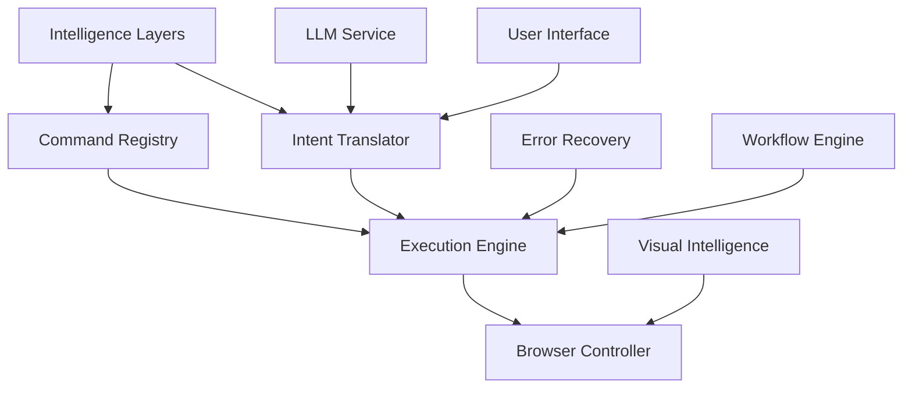

# 🚀 RainbowBrowserAI Practical Implementation Plan

## Executive Summary

Transform our 5-layer intelligence architecture into a working browser automation system that surpasses browser-use by combining intelligent understanding with practical execution capabilities.

## Current State Analysis

### ✅ What We Have Built
1. **5-Layer Intelligence Stack** (Completed)
   - SimpleOrganicPerception: Pattern matching with learning
   - EnhancedOrganicPerception: Memory-enhanced cross-session learning
   - ContextualAwareness: Environmental and situational understanding
   - ContextualPerception: Integrated multi-layer intelligence
   - CreativeEngine: Problem-solving and alternative generation

2. **Basic Browser Control** (Exists but Limited)
   - SimpleBrowser with Selenium/ChromeDriver
   - Basic navigation and screenshot capabilities
   - Mock LLM service for testing

### ❌ What's Missing for Real-World Use
1. **Intelligence-to-Action Bridge**: No connection between understanding and browser commands
2. **Command Registry System**: No structured command execution like browser-use
3. **Real Browser Automation**: Limited actual browser control capabilities
4. **Production LLM Integration**: Still using mock mode
5. **Error Recovery**: No intelligent error handling
6. **User Interface**: No practical way for users to interact

## 📋 Refined Modular Development Plan

### Phase 1: Command System Foundation (Week 1)
**Goal**: Build a command registry system that leverages our intelligence layers

#### Module 1.1: Intelligent Command Registry
```rust
// command_registry.rs
pub struct IntelligentCommandRegistry {
    commands: HashMap<String, CommandDefinition>,
    intelligence: Arc<ContextualPerception>,
    execution_history: Vec<ExecutionRecord>,
}

pub struct CommandDefinition {
    name: String,
    description: String,
    parameters: Vec<ParameterDef>,
    preconditions: Vec<Precondition>,
    success_criteria: Vec<SuccessCriterion>,
    fallback_strategies: Vec<FallbackStrategy>,
}
```

**Key Features**:
- Command registration with semantic understanding
- Intelligent parameter inference
- Success/failure learning
- Dynamic command adaptation

#### Module 1.2: Command Execution Engine
```rust
// execution_engine.rs
pub struct IntelligentExecutor {
    registry: Arc<IntelligentCommandRegistry>,
    browser_pool: Arc<BrowserPool>,
    memory: Arc<SimpleMemory>,
    context_awareness: Arc<ContextualAwareness>,
}
```

**Deliverables**:
- [ ] Command registration system
- [ ] Execution engine with intelligence integration
- [ ] Basic command definitions (navigate, click, input, etc.)
- [ ] Command success tracking

### Phase 2: Browser Automation Enhancement (Week 2)
**Goal**: Expand browser control capabilities with intelligent features

#### Module 2.1: Enhanced Browser Controller
```rust
// enhanced_browser.rs
pub struct EnhancedBrowserController {
    selenium_driver: WebDriver,
    perception: Arc<ContextualPerception>,
    element_finder: IntelligentElementFinder,
    action_executor: SmartActionExecutor,
}
```

**Features**:
- Intelligent element location (beyond CSS selectors)
- Adaptive wait strategies
- Visual element recognition
- Fallback element finding strategies

#### Module 2.2: Smart Action Executor
```rust
// smart_actions.rs
pub struct SmartActionExecutor {
    basic_actions: BasicActionSet,
    creative_engine: Arc<CreativeEngine>,
    context: Arc<ContextualAwareness>,
}
```

**Capabilities**:
- Multi-strategy element interaction
- Automatic retry with different approaches
- Context-aware action timing
- Success validation

**Deliverables**:
- [ ] Enhanced element finding (semantic, visual, contextual)
- [ ] Intelligent wait conditions
- [ ] Retry mechanisms with alternative strategies
- [ ] Action validation and verification

### Phase 3: Intelligence-Action Bridge (Week 3)
**Goal**: Connect our AI understanding to browser actions

#### Module 3.1: Intent-to-Action Translator
```rust
// intent_translator.rs
pub struct IntentToActionTranslator {
    perception: Arc<ContextualPerception>,
    command_registry: Arc<IntelligentCommandRegistry>,
    action_planner: ActionPlanner,
}

impl IntentToActionTranslator {
    pub async fn translate(&self, user_intent: &str) -> Result<ActionPlan> {
        // Use our 5-layer intelligence to understand intent
        let understanding = self.perception.understand_intent(user_intent).await?;
        
        // Generate action plan using creative engine
        let creative_plan = self.generate_creative_plan(&understanding).await?;
        
        // Map to executable browser commands
        let action_plan = self.map_to_commands(&creative_plan).await?;
        
        Ok(action_plan)
    }
}
```

#### Module 3.2: Adaptive Execution Pipeline
```rust
// adaptive_pipeline.rs
pub struct AdaptiveExecutionPipeline {
    translator: Arc<IntentToActionTranslator>,
    executor: Arc<IntelligentExecutor>,
    monitor: ExecutionMonitor,
    learning_system: Arc<SimpleMemory>,
}
```

**Features**:
- Real-time execution monitoring
- Dynamic plan adjustment
- Failure recovery with creative alternatives
- Continuous learning from outcomes

**Deliverables**:
- [ ] Intent understanding to action mapping
- [ ] Multi-step action planning
- [ ] Execution monitoring and adjustment
- [ ] Learning from execution outcomes

### Phase 4: Real LLM Integration (Week 4)
**Goal**: Replace mock LLM with real AI models

#### Module 4.1: Multi-Model LLM Service
```rust
// llm_integration.rs
pub struct MultiModelLLMService {
    primary_model: Box<dyn LLMProvider>, // Claude, GPT-4, etc.
    fallback_model: Box<dyn LLMProvider>,
    local_model: Option<Box<dyn LLMProvider>>, // Llama, etc.
    intelligence_layer: Arc<ContextualPerception>,
}
```

**Features**:
- Multiple LLM provider support
- Intelligent model selection based on task
- Cost optimization
- Privacy-aware routing

#### Module 4.2: Prompt Engineering System
```rust
// prompt_system.rs
pub struct IntelligentPromptSystem {
    template_library: HashMap<TaskType, PromptTemplate>,
    context_injector: ContextInjector,
    memory_augmenter: MemoryAugmenter,
}
```

**Deliverables**:
- [ ] OpenAI API integration
- [ ] Anthropic Claude integration
- [ ] Local model support (Ollama)
- [ ] Intelligent prompt generation
- [ ] Cost tracking and optimization

### Phase 5: Production Features (Week 5)
**Goal**: Add essential production capabilities

#### Module 5.1: Error Recovery System
```rust
// error_recovery.rs
pub struct IntelligentErrorRecovery {
    error_classifier: ErrorClassifier,
    recovery_strategies: HashMap<ErrorType, RecoveryStrategy>,
    creative_engine: Arc<CreativeEngine>,
}
```

**Features**:
- Error pattern recognition
- Intelligent recovery strategies
- Learning from failures
- Graceful degradation

#### Module 5.2: User Interface Layer
```rust
// user_interface.rs
pub struct RainbowInterface {
    cli_interface: CLIInterface,
    web_dashboard: WebDashboard,
    api_server: APIServer,
}
```

**Deliverables**:
- [ ] Advanced error handling and recovery
- [ ] CLI interface for commands
- [ ] Web dashboard for monitoring
- [ ] REST API for integration
- [ ] WebSocket for real-time updates

### Phase 6: Advanced Capabilities (Week 6)
**Goal**: Implement features that surpass browser-use

#### Module 6.1: Visual Understanding
```rust
// visual_intelligence.rs
pub struct VisualIntelligence {
    screenshot_analyzer: ScreenshotAnalyzer,
    element_recognizer: VisualElementRecognizer,
    layout_understanding: LayoutAnalyzer,
}
```

**Features**:
- Screenshot-based element detection
- Visual layout understanding
- OCR for text extraction
- Visual similarity matching

#### Module 6.2: Workflow Automation
```rust
// workflow_automation.rs
pub struct IntelligentWorkflowEngine {
    workflow_designer: WorkflowDesigner,
    parallel_executor: ParallelExecutor,
    checkpoint_manager: CheckpointManager,
}
```

**Deliverables**:
- [ ] Visual element recognition
- [ ] Complex workflow design and execution
- [ ] Parallel action execution
- [ ] Checkpoint and resume capability
- [ ] Workflow learning and optimization

## 📊 Implementation Priorities

### Critical Path (Must Have)
1. **Week 1**: Command Registry + Basic Execution
2. **Week 2**: Enhanced Browser Control
3. **Week 3**: Intelligence-Action Bridge
4. **Week 4**: Real LLM Integration

### Enhancement Path (Should Have)
5. **Week 5**: Error Recovery + Basic UI
6. **Week 6**: Visual Intelligence + Workflows

### Optional Enhancements (Nice to Have)
- Voice command interface
- Mobile browser support
- Distributed execution
- Plugin system

## 🔧 Technical Implementation Details

### Technology Stack
```yaml
Core:
  Language: Rust
  Runtime: Tokio (async)
  
Browser Control:
  Primary: thirtyfour (Selenium WebDriver)
  Alternative: chromiumoxide (CDP)
  
Intelligence:
  LLM: OpenAI, Anthropic, Ollama
  Memory: File-based (JSON) → PostgreSQL
  Cache: LRU in-memory → Redis
  
Interface:
  CLI: clap + colored output
  Web: Axum + React
  API: REST + WebSocket
  
Testing:
  Unit: cargo test
  Integration: Docker Compose
  E2E: Playwright
```

### Module Dependencies


## 📈 Success Metrics

### Phase 1-2 Success Criteria
- [ ] Successfully execute 10 different browser commands
- [ ] 80% success rate on element finding
- [ ] <2s average command execution time

### Phase 3-4 Success Criteria
- [ ] Understand and execute natural language commands
- [ ] 90% intent understanding accuracy
- [ ] Successfully integrate with 2+ LLM providers

### Phase 5-6 Success Criteria
- [ ] 95% error recovery rate
- [ ] Visual element detection accuracy >85%
- [ ] Execute complex multi-step workflows

## 🚀 Getting Started

### Week 1 Immediate Actions
1. Create `command_registry.rs` module
2. Define core command structures
3. Implement basic command registration
4. Create execution engine skeleton
5. Test with simple navigation commands

### Development Approach
1. **Test-Driven**: Write tests first for each module
2. **Incremental**: Build and test one module at a time
3. **Integration**: Continuously integrate with existing intelligence layers
4. **Documentation**: Document as we build

## 📝 Example Implementation

### Sample Command Registration
```rust
// Example: Registering an intelligent click command
registry.register_command(
    CommandDefinition {
        name: "intelligent_click".to_string(),
        description: "Click on elements with multiple strategies".to_string(),
        parameters: vec![
            ParameterDef {
                name: "target".to_string(),
                param_type: ParamType::String,
                required: false, // Can infer from context
                description: "Element to click".to_string(),
            }
        ],
        preconditions: vec![
            Precondition::ElementExists,
            Precondition::ElementVisible,
        ],
        success_criteria: vec![
            SuccessCriterion::ElementClicked,
            SuccessCriterion::PageChanged,
        ],
        fallback_strategies: vec![
            FallbackStrategy::ScrollToElement,
            FallbackStrategy::WaitAndRetry,
            FallbackStrategy::UseAlternativeSelector,
            FallbackStrategy::VisualClick,
        ],
    }
);
```

### Sample Natural Language Processing
```rust
// User says: "Book a flight to Paris next month"
let understanding = perception.understand_intent(input).await?;
// Returns: TaskType::Planning, Confidence: 0.85

let action_plan = translator.translate(understanding).await?;
// Generates: 
// 1. NavigateCommand("https://flights.google.com")
// 2. InputCommand(destination: "Paris")
// 3. SelectDateCommand(next_month())
// 4. ClickCommand("Search")

let result = executor.execute(action_plan).await?;
// Executes with monitoring, learning, and recovery
```

## 🎯 Next Steps

1. **Review and Approve** this plan
2. **Start Week 1** implementation
3. **Daily Progress Updates**
4. **Weekly Demo and Review**
5. **Continuous Integration** with existing intelligence

This plan bridges our advanced AI intelligence with practical browser automation, creating a system that not only matches browser-use but significantly surpasses it through intelligent understanding, learning, and adaptation.