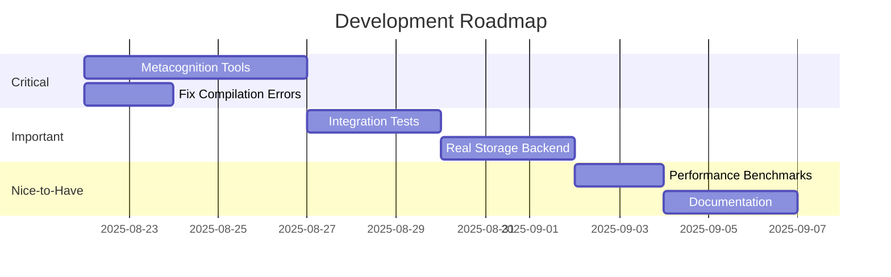

# Tools Architecture Analysis Report

*Date: 2025-08-21*  
*Analyst: Senior Software Architect Review*

## 1. Architecture Design Assessment 🏗️

### Overall Architecture: **7.5/10** - Good with Room for Improvement

#### ✅ Strengths

1. **Clear Trait-Based Design**
   ```rust
   trait Tool: Send + Sync {
       type Input: Serialize + Deserialize;
       type Output: Serialize + Deserialize;
       async fn execute(&self, params: Self::Input) -> Result<Self::Output>;
   }
   ```
   - Excellent use of Rust's type system
   - Async-first design for non-blocking operations
   - Thread-safe by default (Send + Sync)

2. **Layered Architecture**
   - Clear separation between tool categories
   - Each category has its own module
   - Consistent input/output patterns

3. **Dynamic Registry System**
   - `ToolRegistry` allows runtime tool discovery
   - `DynamicTool` wrapper enables JSON-based execution
   - Good for plugin architecture

#### ⚠️ Weaknesses

1. **Circular Dependencies Risk**
   - Tools depend on `Browser` which could depend on tools
   - Memory tools reference browser unnecessarily
   - Need better dependency injection

2. **Missing Abstraction Layers**
   - No interface between tools and WebDriver
   - Direct thirtyfour dependency creates tight coupling
   - Should have browser abstraction layer

3. **Error Handling Inconsistency**
   - Mix of `anyhow::Error` and `ToolError`
   - Conversion conflicts (`From` trait conflicts)
   - Need unified error strategy

### Recommended Architecture Improvements

```rust
// Better dependency injection
pub trait BrowserInterface: Send + Sync {
    async fn execute_script(&self, script: &str) -> Result<Value>;
    async fn find_element(&self, selector: &str) -> Result<Element>;
}

// Tool factory pattern
pub trait ToolFactory {
    fn create_tool(&self, config: ToolConfig) -> Box<dyn Tool>;
}

// Event-driven architecture
pub trait ToolEventHandler {
    async fn on_before_execute(&self, tool: &str, input: &Value);
    async fn on_after_execute(&self, tool: &str, output: &Value);
    async fn on_error(&self, tool: &str, error: &ToolError);
}
```

## 2. Code Organization Structure 📁

### Organization Quality: **8/10** - Well Structured

#### ✅ Excellent Organization

```
src/tools/
├── mod.rs                    # Central registry and traits
├── types.rs                  # Shared types
├── errors.rs                 # Error definitions
├── config.rs                 # Configuration
├── common/                   # Shared utilities
├── navigation/               # Category: Navigation tools
│   ├── mod.rs               # Category exports
│   ├── navigate_to_url.rs  # Individual tool
│   └── scroll_page.rs      # Individual tool
├── interaction/             # Category: User interactions
├── synchronization/         # Category: Wait operations
├── data_extraction/         # Category: Data extraction
├── memory/                  # Category: State management
├── intelligence/            # Category: AI integration (empty)
└── advanced_automation/     # Category: Complex workflows
```

**Strengths:**
- One tool per file - excellent modularity
- Category-based organization matches V8.0 spec
- Consistent naming conventions
- Clear module boundaries

#### ⚠️ Areas for Improvement

1. **Test Organization**
   - Tests scattered (some in `tests.rs`, some in modules)
   - Should have `tests/` subdirectory per category
   - Missing integration test structure

2. **Documentation Structure**
   - Need `docs/` folder with API documentation
   - Missing architecture decision records (ADRs)
   - No examples directory structure

3. **Configuration Management**
   - Single `config.rs` file might grow too large
   - Consider category-specific configs
   - Missing environment-based configuration

### Suggested Reorganization

```
src/tools/
├── core/                    # Core abstractions
│   ├── mod.rs
│   ├── traits.rs           # Tool, MemoryTool, etc.
│   ├── registry.rs         # Tool registry
│   └── errors.rs           # Error types
├── implementations/         # Tool implementations
│   ├── navigation/
│   ├── interaction/
│   └── ...
├── tests/                   # All tests
│   ├── unit/
│   ├── integration/
│   └── benchmarks/
└── docs/                    # Documentation
    ├── api/
    ├── examples/
    └── architecture/
```

## 3. Project Completeness Analysis 📊

### Completion Status: **66% Overall, 83% V8.0 Compliance**

#### ✅ Completed Components (High Quality)

| Component | Completeness | Quality | Notes |
|-----------|--------------|---------|-------|
| Navigation | 100% | A | Robust retry logic, performance metrics |
| Interaction | 100% | A- | Smart strategies, good error handling |
| Synchronization | 100% | B+ | Basic but functional |
| Data Extraction | 100% | A | Comprehensive extractors |
| Memory | 100% | B+ | Good design, needs real storage |
| Advanced Automation | 100% | A- | Powerful but complex |

#### ❌ Missing/Incomplete Components

1. **Metacognition Tools (0%)**
   - DecisionAnalyzer not implemented
   - SelfOptimizer not implemented
   - Critical for V8.0 compliance

2. **Intelligence Module (0%)**
   - Empty module structure
   - No AI integration implemented
   - Missing LLM connectors

3. **Testing Infrastructure (30%)**
   - Unit tests incomplete
   - Integration tests missing
   - No performance benchmarks
   - No load testing

4. **Documentation (40%)**
   - API docs incomplete
   - Missing usage examples
   - No troubleshooting guide
   - No performance tuning guide

5. **Production Readiness (20%)**
   - No monitoring/metrics
   - Missing health checks
   - No rate limiting
   - No circuit breakers

### Priority Improvements Roadmap



## 4. Performance & Security Analysis 🔒

### Performance Issues: **Medium Risk**

#### 🐌 Performance Concerns

1. **Memory Leaks Risk**
   ```rust
   // Current: Unbounded growth
   storage: Arc<RwLock<HashMap<Uuid, MemoryStorage>>>
   
   // Better: Bounded with LRU
   storage: Arc<RwLock<LruCache<Uuid, MemoryStorage>>>
   ```

2. **Blocking Operations**
   - File I/O in async context without `tokio::fs`
   - Synchronous JSON parsing in hot paths
   - No connection pooling for WebDriver

3. **Inefficient Algorithms**
   - O(n) searches in history tracker
   - No indexing for large datasets
   - Linear scans for pattern matching

4. **Resource Management**
   - No timeout mechanisms in some tools
   - Unbounded retry attempts
   - No backpressure handling

### Security Issues: **High Risk** 🚨

#### 🔴 Critical Security Issues

1. **Script Injection Vulnerability**
   ```rust
   // DANGEROUS: Direct script execution
   browser.execute_script(&format!(
       "document.querySelector('{}').click()", 
       selector  // User input not sanitized!
   ))
   ```
   **Fix:** Use parameterized scripts or sanitize input

2. **Path Traversal Risk**
   ```rust
   // DANGEROUS: Direct path usage
   let storage_path = PathBuf::from(user_provided_path);
   ```
   **Fix:** Validate and sandbox paths

3. **No Input Validation**
   - URLs not validated before navigation
   - Selectors not sanitized
   - File paths not checked

4. **Sensitive Data Exposure**
   - Passwords in memory (TypeText tool)
   - No encryption for PersistentCache
   - History contains sensitive actions
   - Logs might contain credentials

5. **Missing Security Features**
   - No rate limiting
   - No authentication/authorization
   - No audit logging
   - No secure storage

### Security Recommendations

```rust
// 1. Input Sanitization
fn sanitize_selector(selector: &str) -> Result<String> {
    // Remove dangerous characters
    let cleaned = selector
        .replace('\'', "")
        .replace('"', "")
        .replace('\\', "");
    validate_css_selector(&cleaned)?;
    Ok(cleaned)
}

// 2. Secure Storage
use ring::aead;
struct SecureCache {
    cipher: aead::LessSafeKey,
    // Encrypt all stored values
}

// 3. Rate Limiting
use governor::{Quota, RateLimiter};
struct RateLimitedTool {
    limiter: RateLimiter<NotKeyed, InMemoryState>,
}

// 4. Audit Logging
trait AuditLog {
    fn log_action(&self, user: &str, action: &str, result: &Result<()>);
}
```

### Performance Recommendations

```rust
// 1. Connection Pooling
struct BrowserPool {
    connections: Vec<Arc<Browser>>,
    semaphore: Semaphore,
}

// 2. Async I/O
use tokio::fs;
async fn save_cache(&self, data: &[u8]) -> Result<()> {
    fs::write(&self.path, data).await?;
    Ok(())
}

// 3. Indexing
use tantivy::{Index, Document};
struct IndexedHistory {
    index: Index,
    // Fast full-text search
}

// 4. Caching Strategy
use moka::future::Cache;
struct CachedBrowser {
    element_cache: Cache<String, Element>,
    script_cache: Cache<String, Value>,
}
```

## 5. Overall Assessment Summary

### Grades by Category

| Aspect | Grade | Status |
|--------|-------|--------|
| **Architecture Design** | B+ | Good foundation, needs abstraction improvements |
| **Code Organization** | A- | Excellent structure, minor improvements needed |
| **Completeness** | C+ | 66% complete, critical gaps in V8.0 |
| **Performance** | C | Functional but needs optimization |
| **Security** | D | Critical vulnerabilities need immediate attention |
| **Overall** | **B-** | **Solid foundation with critical security issues** |

### Top Priority Actions

1. **🔴 CRITICAL: Fix Security Vulnerabilities**
   - Sanitize all user inputs
   - Implement secure storage
   - Add authentication/authorization

2. **🟠 HIGH: Complete V8.0 Compliance**
   - Implement Metacognition tools
   - Fix compilation errors
   - Add integration tests

3. **🟡 MEDIUM: Performance Optimization**
   - Implement connection pooling
   - Add caching layers
   - Optimize algorithms

4. **🟢 LOW: Documentation & Polish**
   - Complete API documentation
   - Add examples
   - Create troubleshooting guide

## 6. Recommendations

### Immediate Actions (Week 1)
1. Fix script injection vulnerabilities
2. Implement input validation
3. Complete Metacognition tools
4. Fix compilation errors

### Short-term (Weeks 2-3)
1. Add secure storage encryption
2. Implement rate limiting
3. Create comprehensive tests
4. Add monitoring/metrics

### Long-term (Month 2)
1. Refactor to plugin architecture
2. Implement distributed caching
3. Add horizontal scaling support
4. Create admin dashboard

## Conclusion

The RainbowBrowserAI tools implementation shows **excellent architectural thinking** and **clean code organization**. However, it has **critical security vulnerabilities** that must be addressed immediately before any production use. The project is 66% complete overall, with good progress toward V8.0 compliance (83%).

The strongest aspects are the trait-based design and modular organization. The weakest areas are security (especially input validation) and the missing Metacognition tools needed for full V8.0 compliance.

With focused effort on security fixes and completing the remaining tools, this could become a production-ready, enterprise-grade browser automation framework.

---

*Analysis Date: 2025-08-21*  
*Recommendation: Continue development with immediate focus on security*